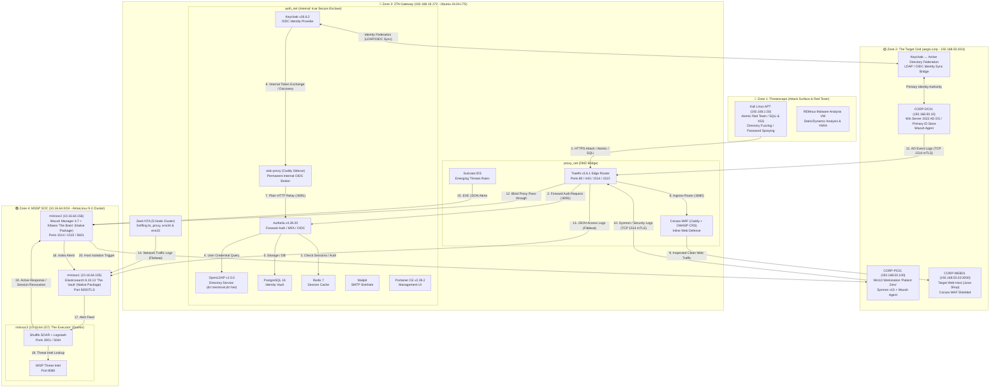

# AEGIS v2.1: Project Report & Master Architecture Blueprint
**Sovereign Zero-Trust Access Gateway & Hybrid MSSP SOC Architecture**
*Author: TAIBI MOHAMED ANIS (Ezio) — Network Security Architect*
*PFE 2026 — Version 2.1 Final Master Synthesis*

---

## Section 1: Executive Summary — "AEGIS v2.1: The Achievable Resilient SOC"

### 1.1 Project Identity
AEGIS is a sovereign, end-to-end cybersecurity architecture built on the fundamental **"Never Trust / Always Verify"** Zero-Trust Access (ZTA) paradigm. It bridges a local, hardened BeyondCorp-style Edge Gateway with a remote, multi-node Managed Security Service Provider (MSSP) Security Operations Center (SOC). Designed for enterprise resilience, AEGIS enforces strict identity verification, continuous behavioral telemetry, automated threat intelligence enrichment, and autonomous active response across a segmented four-zone hybrid topology.

### 1.2 Evolution: What v2.1 Changed from v2.0
AEGIS v2.1 represents a tactical restructuring of the project to eliminate fragile architectural dependencies, remediate security technical debt, and ensure absolute operational reliability for jury demonstration:

1. **GNS3 Virtual Routing Engine Deprecated**: Nested hypervisor routing (VMware → GNS3 VM → QEMU/KVM) suffered severe I/O contention under concurrent SIEM and endpoint telemetry workloads. In v2.1, routing is replaced by native Linux kernel bridge networks (`proxy_net` DMZ + `auth_net` Secure Enclave with `internal: true`) and VMware VMnet port groups, delivering microsecond latency and zero stability overhead.
2. **Deterministic SOAR ("Mahoraga v2.1") Replaces Custom ML Black Box**: The theoretical Scikit-Learn Isolation Forest on `minisoc3` was an unverified, disconnected black box. AEGIS v2.1 replaces it with **Shuffle SOAR** integrated with **Logstash** and a **MISP Threat Intelligence** instance. Threat response is now fully deterministic, debuggable, and visually demonstrable via automated API workflows.
3. **Core Gateway Hardening & Security Debt Elimination**:
   - Upgraded Traefik to `v3.6.1` to resolve Docker daemon API v1.54 socket protocol breaking changes.
   - Disabled insecure management plane access (`api.insecure: false`) and removed raw API port exposures.
   - Fixed Forward-Auth path to `/api/authz/forward-auth` (resolving silent 404 authentication bypasses).
   - Regenerated TLS certificates for the proper `*.zerotrust.lan` domain.
   - Removed embedded RSA private keys from Authelia configuration and configured external `oidc.key` reference.
   - Upgraded Argon2id password hashing parameters (`memory: 65536 KB`, `iterations: 3`, `parallelism: 4`).
   - Reduced session persistence from 1 year to 72 hours to uphold continuous verification principles.
   - Applied safe SQL script password rotations across PostgreSQL accounts and purged orphaned `.env` files.
    - Switched Keycloak from `start-dev` to `start` (plain production mode — `--optimized` was attempted but requires a pre-built image via `kc.sh build`, which this deployment does not use).
4. **Active Edge Defenses Added**: Integrated **Coraza WAF** (Caddy plugin with OWASP Core Rule Set) inline to protect target web applications, **Suricata IDS** container on `proxy_net` with Emerging Threats Open rules, and host-level **Zeek NTA** (5-node cluster on `br_proxy`, `ens34`, and `ens33`).
5. **Zone 2 Target Grid Architecture**: Restructured the corporate target enclave (`aegis.corp` on `192.168.50.0/24`) around core enterprise identity and segmented target workloads: Windows Server 2022 Active Directory Domain Controller (`CORP-DC01` as primary enterprise identity store), Windows 10 domain workstation (`CORP-PC01` "Patient Zero") instrumented with Sysmon v15 and Wazuh Agent, target web application host (`CORP-WEB01` hosting Juice Shop), and **Keycloak ↔ Active Directory Federation** via LDAP/OIDC sync. Standalone `CORP-DB01` was removed in favor of enterprise AD identity federation and WAF-shielded web assets.

### 1.3 Honest Per-Zone Implementation Status & Regression Notice
> **⚠️ Regression Risk Notice**: Gateway hardening (Argon2id parameters, session policy, Keycloak mode, orphaned secret files) has previously regressed silently between work sessions on this project — likely due to config files being reverted from an older snapshot. Status in this report reflects the most recent live verification (September 8, 2026), not a permanent guarantee. Recommend periodic live re-audits rather than trusting checklist state alone.

- **Zone 3 Gateway Sensors & Hardening**: **Done (Fully Operational & Verified)** — Verified via live audits (September 19–21, 2026). All 9 core containers healthy, dual bridge isolation (`proxy_net` DMZ + `auth_net` `internal: true`) active, Forward-Auth MFA enforced with group-based restrictions and explicit deny rules, and Suricata IDS operational. Coraza WAF routing bypass has been fully resolved: Traefik dynamic routing repointed to `http://coraza:8080`, inline blocking verified against SQLi/UNION/XSS with HTTP 403, and CORP-WEB01 decoupled from Authelia for public WAF-only protection.
- **Zone 2 Target Grid**: **Active Subnet / In-Progress** — Subnet `192.168.50.0/24` (`VMnet3`) configured with cross-zone routing via `ens34`. `CORP-DC01` (primary enterprise identity store), `CORP-PC01` ("Patient Zero"), `CORP-WEB01` (target web host), and Keycloak ↔ Active Directory Federation integrated (standalone `CORP-DB01` removed).
- **Zone 4 Detection Pipeline & SOC Automation**: **Telemetry Pipeline Verified & SOAR In Progress (Operational\*)** — Zone 4 detection pipeline (Zeek/Suricata/Authelia/Coraza/Keycloak → Wazuh agent → MITRE-tagged rules on minisoc2) verified end-to-end. Centralized identity migration (OpenLDAP + Authelia LDAP backend + Keycloak OIDC federation via oidc-proxy) completed across Stages 1-3. Per-source index split (`wazuh-alerts-authelia-*`, `wazuh-alerts-coraza-*`, `wazuh-alerts-keycloak-*`) active with 2 dedicated Kibana dashboards. `minisoc3` automation stack (5-container Shuffle with shuffle-opensearch + Logstash webhook wired + MISP TLS port 443 + Nginx .dz reverse proxy) healthy. Shuffle SOAR workflow `misp_enrichment` verified with real live Wazuh alert (T1055) and matching MISP restSearch lookup. Outstanding: decision/branch node and full multi-stage attack flow.
- **Zone 1 Threatscape & Red Team Engine**: **Configured & Ready** — Red team attack surface and adversary station featuring Atomic Red Team (automated execution framework), Web Application Exploitation (SQLi & XSS), Directory Fuzzing & Path Traversal (gobuster, ffuf, dirbuster), and Credential Attacks (Brute Force & Password Spraying), supplemented by Sliver C2 and REMnux malware analysis sandbox.

### 1.4 What AEGIS Does and How It Enforces Zero Trust

AEGIS is not a firewall in the traditional sense — it's a policy enforcement point sitting at the only entrance to the protected network. Every request, internal or external, is treated as untrusted until proven otherwise: never trust, always verify.

Traffic routing: Traefik is the single ingress. All external traffic hits ports 80/443/1514/1515 on the Gateway; everything else is invisible — there is no other path in. Traefik terminates TLS, then either (a) forwards to Authelia for an auth check before reaching any protected service, or (b) TCP-proxies Wazuh agent traffic straight through to the remote SOC without exposing the SOC's real address (blind routing).

Enforcement, not just inspection: Two Docker bridge networks do the actual isolation. proxy_net is the DMZ — internet-facing, holds only Traefik and the inline defenses (Coraza WAF, Suricata IDS). auth_net is marked internal: true at the kernel level — Authelia, Keycloak, Postgres, Redis have no route to the internet or the host, regardless of firewall rules. This isn't application-layer policy that can be misconfigured away; it's enforced by the Linux kernel's network namespace isolation.

Authentication chain: Traefik → forwardAuth → Authelia (session/MFA check) → Keycloak (OIDC identity source of truth) → per-resource ACL decision. No session, no MFA, no route — the request never reaches the backend.

Continuous verification: Sessions expire in 72 hours, not a year — the "always verify" half of the model, so a stolen session doesn't grant indefinite access

---

## Section 2: Full Architecture Topology — 4 Zones

### 2.1 Master Topology Schematic (Mermaid.js)



### 2.2 Detailed High-Density ASCII Architecture Map

```
========================================================================================================================
                                           AEGIS v2.1 MASTER TOPOLOGY MAP
========================================================================================================================

 [ ZONE 1: THREATSCAPE ]                     [ ZONE 2: THE TARGET GRID (aegis.corp - 192.168.50.0/24) ]
 +----------------------------------+        +-------------------------------------------------------------------------+
 | Kali Linux APT (192.168.1.50)   |        | CORP-DC01 (192.168.50.10) - Win Server 2022 AD DS (Primary ID Store)    |
 | - Atomic Red Team Framework      |        | - Active Directory Domain Services / Kerberos KDC / DNS                |
 | - Web Exploitation: SQLi & XSS   |        | - Wazuh Agent (Win Events: 4625, 4768, 4769)                          |
 | - Directory Fuzzing & Traversal  |        | CORP-PC01 (192.168.50.100) - Win10 Pro "Patient Zero"                  |
 | - Brute Force / Password Spray   |        | - Sysmon v15 + Wazuh Agent (Event IDs 1, 3, 7, 10, 11, 22)              |
 | - Sliver C2 & Burp Suite Pro     |        | CORP-WEB01 (192.168.50.20) - Target Web Host (OWASP Juice Shop)        |
 | REMnux Malware Sandbox           |        | - Micro-segmented Subnet / Shielded inline by Coraza WAF (OWASP CRS)   |
 +----------------------------------+        | Keycloak ↔ Active Directory Federation (LDAP/OIDC Identity Sync Bridge) |
                  |                          +-------------------------------------------------------------------------+
                  | Attack Vectors                                          ^
                  v                                                         | (LDAP/OIDC Sync)
 +---------------------------------------------------------------------------------------------------------------------+
 | ZONE 3: ZTA GATEWAY (192.168.19.173 - Ubuntu 24.04 LTS Host)                                                        |
 |                                                                                                                     |
 |  [ DMZ Bridge: proxy_net ]                                                                                          |
 |  +---------------------------------------------------------------------------------------------------------------+  |
 |  | Traefik v3.6.1 Edge Router (Ports 80/443 exposed, 1514/1515 TCP Proxying)                                   |  |
 |  | Coraza WAF (Caddy + OWASP CRS - Port 8080)  |  Suricata IDS (Emerging Threats Rules)                              |  |
 |  +---------------------------------------------------------------------------------------------------------------+  |
 |                                | Forward Auth (/api/authz/forward-auth)                                             |
 |  [ Secure Enclave Bridge: auth_net (internal: true - No Host Port Exposure) ]                                         |
 |  +---------------------------------------------------------------------------------------------------------------+  |
 |  | Authelia v4.39.20 (Port 9091)   | Keycloak v26.6.2 (Port 8080)    | OpenLDAP v1.5.0 (Port 389)                 |  |
 |  | oidc-proxy Caddy Sidecar (:8080)| PostgreSQL 16 Vault (Port 5432) | Redis 7 Session Cache (Port 6379)          |  |
 |  | Mailpit Sinkhole (Port 8025)    | Portainer CE v2.39.2 (Port 9000)                                             |  |
 |  +---------------------------------------------------------------------------------------------------------------+  |
 |                                                                                                                     |
 |  Host Extensions: Zeek NTA 5-Node (sniffing br_proxy, ens34, ens33) | Target Route: CORP-WEB01 (192.168.50.20:3000) |
 +---------------------------------------------------------------------------------------------------------------------+
                  |                                                  |
                  | Telemetry (TCP:1514 mTLS)                        | Filebeat Log Shipping (TCP:9200 TLS)
                  v                                                  v
 +---------------------------------------------------------------------------------------------------------------------+
 | ZONE 4: MSSP SOC CLUSTER (10.16.64.0/24 - AlmaLinux 9.3 Cluster)                                                     |
 |                                                                                                                     |
 |  minisoc1 (10.16.64.155) "The Vault"    | minisoc2 (10.16.64.156) "The Brain"   | minisoc3 (10.16.64.157) "The Executor"|
 |  - Elasticsearch 8.19.13 (Native RPM)   | - Wazuh Manager 4.7 (Native RPM)      | - Shuffle SOAR + Logstash (Docker)   |
 |  - JVM Heap: 8GB locked                 | - Kibana 8.19.13 (Native RPM)         | - MISP Threat Intel (Port 8080)      |
 |  - Primary Telemetry Storage            | - Active Response Engine              | - Automated Response Engine          |
 +---------------------------------------------------------------------------------------------------------------------+
========================================================================================================================
```

---

## Section 3: Sub-Topologies — One Per Zone

### 3.1 Zone 1 Sub-Topology (Threatscape & Red Team Engine)
```
  +-------------------------------------------------------------------------------+
  | ZONE 1: THREATSCAPE                                                           |
  |                                                                               |
  |  +-----------------------------------+     +-------------------------------+  |
  |  | Kali Linux (192.168.1.50)         |     | REMnux Malware Analysis VM    |  |
  |  | - Atomic Red Team Framework       |     | - Static analysis (yara, pe)  |  |
  |  | - Web Exploits (SQLi & XSS)       |     | - Dynamic sandbox isolation   |  |
  |  | - Directory Fuzzing & Path Trav   |     | - Payload detonation verify   |  |
  |  | - Brute Force / Password Spray    |     +-------------------------------+  |
  |  | - Sliver C2 & Burp Suite Pro      |                                        |
  |  +-----------------------------------+                                        |
  +-------------------------------------------------------------------------------+
            |                     |                     |
   (SQLi / XSS Attack)   (Sliver HTTPS Beacon)   (DNS Tunneling)
            |                     |                     |
            v                     v                     v
    [ Gateway Port 443 ]  [ Gateway Port 443 ]   [ Gateway Port 53 ]
```
- **Components & Tools**: Kali Linux VM, REMnux VM, Atomic Red Team (automated execution framework), sqlmap, Burp Suite Pro, gobuster, ffuf, dirbuster, hydra/spray tooling, Sliver C2 framework, mimikatz, Wireshark, NetworkMiner.
- **Vectors**:
  - **Atomic Red Team**: Automated execution framework triggering mapped MITRE ATT&CK technique batteries against target hosts.
  - **Web Application Exploitation**: SQL Injection (SQLi) & Cross-Site Scripting (XSS) targeting web applications and API routes.
  - **Directory Fuzzing & Path Traversal**: gobuster, ffuf, dirbuster wordlists probing edge routing, hidden admin panels, and traversal flaws.
  - **Credential Attacks**: Brute force authentication attacks and password spraying targeting edge portals and Active Directory accounts.
  - **C2 & Post-Exploitation**: Sliver C2 HTTPS/DNS beaconing, LSASS memory credential harvesting (Mimikatz), and lateral movement.

### 3.2 Zone 2 Sub-Topology (The Target Grid — `aegis.corp` 192.168.50.0/24)
```
  +-----------------------------------------------------------------------------------------------+
  | ZONE 2: THE TARGET GRID (192.168.50.0/24 - aegis.corp)                                        |
  |                                                                                               |
  |  +---------------------------+  +---------------------------+  +---------------------------+  |
  |  | CORP-DC01 (192.168.50.10) |  | CORP-PC01 (192.168.50.100)|  | CORP-WEB01 (192.168.50.20)|  |
  |  | Win Server 2022           |  | Win10 "Patient Zero"      |  | Target Web Host (Juice)   |  |
  |  | Primary ID Store (AD DS)  |  | Domain Workstation        |  | Shielded by Coraza WAF    |  |
  |  | Kerberos KDC / DNS / DHCP |  | Sysmon v15 + Wazuh Agent  |  | Decoupled from Authelia   |  |
  |  +---------------------------+  +---------------------------+  +---------------------------+  |
  |                ^                              |                                |              |
  |                | (LDAP / OIDC Sync)           | (Sysmon IDs 1,3,10,22)         | (CRS Logs)   |
  |  +-------------v------------------------------v--------------------------------v-----------+  |
  |  | Keycloak ↔ Active Directory Federation (Zone 2 / Zone 3 Enterprise Identity Sync Bridge)|  |
  |  +-----------------------------------------------------------------------------------------+  |
  +-----------------------------------------------|-----------------------------------------------+
                                                  | (Wazuh Agent Protocol TCP:1514 mTLS)
                                                  v
                                      [ Gateway Traefik Proxy ]
```
- **Enterprise Identity Authority & Bridging**:
  - `CORP-DC01`: Windows Server 2022 Active Directory Domain Controller acts as the **primary enterprise identity store** for the entire organization (`aegis.corp`), hosting all authoritative corporate user accounts and security groups.
  - **Keycloak ↔ Active Directory Federation**: Core identity bridging resource connecting Zone 2 and Zone 3 via scheduled LDAP user/group synchronization and OIDC federated realm identity provider. This guarantees that corporate accounts authenticated at the edge correspond directly to Active Directory groups, eliminating siloed credential stores.
  - Standalone `CORP-DB01` (PostgreSQL server) has been removed from the architecture in favor of enterprise AD identity federation and WAF-shielded web services.
- **Target Grid Nodes & Telemetry Configuration**:
  - `CORP-DC01`: Event IDs 4625 (failed login), 4768 (TGT request), 4769 (TGS request), 4672 (special privileges), and directory service change auditing.
  - `CORP-PC01`: Windows 10 client ("Patient Zero") with Sysmon v15 (SwiftOnSecurity configuration) tracking process creation (Event ID 1), network connections (Event ID 3), image loads (Event ID 7), LSASS memory handles (Event ID 10), file creation (Event ID 11), registry changes (Event IDs 12/13), and DNS queries (Event ID 22); primary Wazuh Agent Active Response target.
  - `CORP-WEB01`: Target web host hosting OWASP Juice Shop on `192.168.50.20:3000`. Layer 3 micro-segmented on `VMnet3` via gateway interface `ens34`, shielded inline by Coraza WAF (OWASP CRS v4) with live HTTP 403 enforcement, decoupled from Authelia for public storefront simulation.

#### 3.2.1 Role-Based Access Mapping (Zone 2 — Active Directory)
| AD Security Group | Example Role | Session Length | MFA Re-check Interval | Enforced Scope |
| :--- | :--- | :--- | :--- | :--- |
| **Marketing** | Marketing staff | 8 hours | Login only | Marketing CRM, shared department drive |
| **HR** | HR personnel | 8 hours | Every 2 hours | HR system, payroll & confidential employee records |
| **Developers** | Web developers | 8 hours | Login only (general); two_factor on `/admin.*` | Dev tools + scoped `juiceshop-admins` access |
| **DevOps** | Infrastructure ops | 4 hours | Every 2 hours | Portainer CE, monitoring, CI/CD deploy pipelines |
| **IT** | Gateway / network admin | 2 hours | Every 1 hour or hardware key (FIDO2) | Portainer, mail relay admin, Traefik dynamic config |
| **Executive** | CEO / leadership | 8 hours | Login only | Read-only high-level posture dashboard; **NOT** raw SOC tools |

> **Core Governance Directive:** Privilege maps strictly to **job function** via Active Directory group membership, never to hierarchical org-chart title. An executive account does **NOT** automatically inherit admin-panel or SOC access.

### 3.3 Zone 3 Sub-Topology (ZTA Gateway Container Architecture)
```
  +---------------------------------------------------------------------------------------+
  | ZONE 3: ZTA GATEWAY (192.168.19.173)                                                  |
  |                                                                                       |
  |   [ HOST NETWORKING & ZEEK ]                                                          |
  |   Zeek NTA 5-node cluster (node.cfg on br_proxy, ens34, ens33) ---> /opt/zeek/logs/   |
  |                                                                                       |
  |   [ DMZ Bridge: proxy_net ]                                                           |
  |   +--------------------------------------------------------------------------------+  |
  |   | Traefik v3.6.1 (Ports 80, 443, 1514, 1515)                                      |  |
  |   |  - TLS Termination (*.zerotrust.lan)                                           |  |
  |   |  - Forward Auth Filter (/api/authz/forward-auth)                               |  |
  |   | Coraza WAF Container (Port 8080) | Suricata IDS Container                       |  |
  |   +--------------------------------------------------------------------------------+  |
  |                                        |                                              |
  |   [ Secure Enclave Bridge: auth_net (internal: true) ]                                |
  |   +--------------------------------------------------------------------------------+  |
  |   | Authelia v4.39.20 (:9091) | Keycloak v26.6.2 (:8080) | OpenLDAP v1.5.0 (:389)  |  |
  |   | oidc-proxy Sidecar (:8080)| PostgreSQL 16 (:5432)    | Redis 7 Cache (:6379)   |  |
  |   | Mailpit Sinkhole (:8025)  | Portainer CE (:9000)                               |  |
  |   +--------------------------------------------------------------------------------+  |
  +---------------------------------------------------------------------------------------+
```
- **Port Exposure Matrix**:
  - `80/TCP`: Host exposed → Traefik (Permanent HTTP to HTTPS redirect).
  - `443/TCP`: Host exposed → Traefik (TLS 1.3 termination, Forward-Auth enforced).
  - `1514/TCP`: Host exposed → Traefik TCP Proxy → `minisoc2:1514` (Wazuh agent mTLS).
  - `1515/TCP`: Host exposed → Traefik TCP Proxy → `minisoc2:1515` (Wazuh agent enrollment).
  - `389, 5432, 6379, 8025, 8080, 9000, 9091`: **HOST BLOCKED** (`auth_net` internal: true).

#### 3.3.1 Access Control Model — Customers vs. Employees & Role-Based Enforcement
Two distinct authentication domains exist behind the same edge gateway:
1. **Customer-Facing Application (`juiceshop.zerotrust.lan`)**: Fully decoupled from Authelia — no Authelia policy at all. Customers authenticate via the application's native account system, and the service is protected strictly by Coraza WAF (OWASP Core Rule Set). Enterprise-style MFA on a public customer app would destroy conversion and is explicitly **NOT** how AEGIS is designed.
2. **Employee / Admin Paths**: Governed by Authelia `access_control` with LDAP-derived group membership (`ou=Security_Groups: admins, it_ops, security, users`).

**Current Live Authelia Rule Order:**
- `authelia.zerotrust.lan`: `policy: bypass` (auth layer portal itself)
- `keycloak.zerotrust.lan` OIDC protocol endpoints: `policy: bypass` (OAuth2 flow requirement)
- `keycloak.zerotrust.lan` (rest): `policy: two_factor`, `subject: group:admins`, then explicit `policy: deny` for all others
- `traefik.zerotrust.lan`: `policy: two_factor`, `subject: group:admins`, then explicit `policy: deny` for all others
- `mailpit.zerotrust.lan`: `policy: bypass` (documented dev/test SMTP sinkhole limitation)
- `portainer.zerotrust.lan`: `policy: two_factor`, `subject: group:admins` or `group:it_ops`, then explicit `policy: deny` for all others
- `juiceshop.zerotrust.lan`: no Authelia policy — public, Coraza WAF only
- all other `*.zerotrust.lan`: `policy: two_factor`, any authenticated user

```yaml
# authelia/configuration.yml
access_control:
  default_policy: deny
  rules:
    # 1. Authelia portal — always bypass (is the auth layer itself)
    - domain: "authelia.zerotrust.lan"
      policy: bypass

    # 2. Keycloak OIDC protocol endpoints — bypass (required for OAuth2 / OIDC flow)
    - domain: "keycloak.zerotrust.lan"
      resources:
        - "^/realms/.*/protocol/openid-connect/.*"
        - "^/realms/.*/login-actions/.*"
        - "^/health/.*"
        - "^/js/.*"
        - "^/resources/.*"
        - "^/realms/.*/account/.*"
      policy: bypass

    # 3. Keycloak admin interfaces — two_factor, group:admins only, explicit deny otherwise
    - domain: "keycloak.zerotrust.lan"
      policy: two_factor
      subject: "group:admins"
    - domain: "keycloak.zerotrust.lan"
      policy: deny

    # 4. Traefik dashboard — two_factor, group:admins only, explicit deny otherwise
    - domain: "traefik.zerotrust.lan"
      policy: two_factor
      subject: "group:admins"
    - domain: "traefik.zerotrust.lan"
      policy: deny

    # 5. Mailpit SMTP sinkhole — bypass (dev/test SMTP sinkhole, documented known limitation)
    - domain: "mailpit.zerotrust.lan"
      policy: bypass

    # 6. Portainer (Docker socket, root-equivalent power) — two_factor, admins or it_ops, explicit deny otherwise
    - domain: "portainer.zerotrust.lan"
      policy: two_factor
      subject:
        - "group:admins"
        - "group:it_ops"
    - domain: "portainer.zerotrust.lan"
      policy: deny

    # (Note: juiceshop.zerotrust.lan has no Authelia policy at all — public-facing, protected only by Coraza WAF)

    # 7. Wildcard fallback — two_factor, any authenticated user
    - domain: "*.zerotrust.lan"
      policy: two_factor
```
- **Crucial Rule Evaluation Fix (Subject Mismatch Fallthrough)**: Authelia evaluates rules top-to-bottom and applies the first FULL match (domain + resources + subject). If only the subject fails to match (e.g., non-admin visiting `keycloak.zerotrust.lan`), Authelia does *not* implicitly deny; it falls through to subsequent matching rules — specifically the permissive wildcard rule (`*.zerotrust.lan`, `policy: two_factor`). To prevent unauthorized access, an explicit `policy: deny` rule MUST immediately follow each group-restricted rule for that domain before the wildcard rule is reached. Verified end-to-end with `testuser` (groups: `it_ops`, `users`): 403 denied on Keycloak and Traefik, allowed on Portainer, and bypassed on Juice Shop.
- **Session-Cookie Hijacking Mitigation**: Admin-path MFA re-validates even within an already-valid general session. If an attacker hijacks a standard user session cookie, they cannot silently pivot to `/admin` without completing a secondary hardware/TOTP challenge.
- **TOTP MFA Security Boundary**: TOTP MFA secrets are rendered **once in-browser** during authenticated enrollment and **NEVER transit email / Mailpit**. This is safe by design and entirely immune to mail-sinkhole exposure.

### 3.4 Zone 4 Sub-Topology (MSSP SOC Processing Pipeline)
```
  +---------------------------------------------------------------------------------------+
  | ZONE 4: MSSP SOC CLUSTER (10.16.64.0/24)                                              |
  |                                                                                       |
  |  +---------------------------+   +---------------------------+   +------------------+ |
  |  | minisoc1 (10.16.64.155)  |   | minisoc2 (10.16.64.156)  |   | minisoc3         | |
  |  | "The Vault" (Native RPM)  |   | "The Brain" (Native RPM)  |   | (10.16.64.157)   | |
  |  | - Elasticsearch 8.19.13   |<--| - Wazuh Manager 4.7       |   | "The Executor"   | |
  |  |   (Port 9200/TLS)         |   | - Kibana 8.19.13 (:5601)  |   | (Docker Stack)   | |
  |  | - Raw Indexing & Storage  |   | - Active Response Engine  |---| - Shuffle SOAR   | |
  |  +---------------------------+   +---------------------------+   | - Logstash 8.19  | |
  |                ^                                                 | - MISP Threat    | |
  |                | Shipping                                        |   Intel (:8080)  | |
  |                +-------------------------------------------------+------------------+ |
  +---------------------------------------------------------------------------------------+
```
- **Deployment Details**: `minisoc1` and `minisoc2` are native package installs (RPM/systemd on AlmaLinux 9.3) for bare-metal performance and stability. Only `minisoc3` utilizes a Docker Compose stack to run Shuffle SOAR, Logstash, and MISP.
- **Pipeline Data Flow**:
  1. Telemetry arrives at `minisoc2` via Wazuh agent protocol (TCP 1514).
  2. Wazuh Manager decodes and analyzes rules; alerts are pushed to Filebeat.
  3. Filebeat indexes raw alerts into Elasticsearch on `minisoc1:9200`.
  4. Logstash on `minisoc3` polls/receives alert feed from `minisoc1`.
  5. Logstash triggers **Shuffle SOAR** webhook (`minisoc3:3001`).
  6. Shuffle queries **MISP** (`minisoc3:8080`) for IOC enrichment (hash/IP reputation).
  7. If severe, Shuffle calls Wazuh Active Response API on `minisoc2` and Keycloak Admin REST API to revoke active user tokens and isolate the compromised endpoint.

#### 3.4.1 MSSP Service Tiering & Support Model
- **Tier 1: AEGIS SOC Analysts**: Full raw Kibana access on `minisoc2`, all MITRE-tagged alerts, MISP threat intel correlation, primary alert triage. (The primary paid service).
- **Tier 2: Client IT & DevOps**: Restricted dashboard showing only their own confirmed incidents and summarized severity, or notified only on confirmed Level 12+ escalations. **Not** given raw Kibana access to the shared multi-tenant SOC console.
- **Tier 3: Client Executives**: High-level posture rollup only (Red / Yellow / Green status, MTTD, MTTR, SLA compliance), zero technical alert-level noise.
- **Business Model Value**: This service tiering represents the fundamental business value of the MSSP model — giving clients raw SOC access would undercut the value proposition of managed triage and risk cross-tenant data exposure.

### 3.5 Secure Onboarding & Offboarding Lifecycle Flow (6 Steps)
1. **Step 1 (AD Account & Group Assignment)**: IT/HR creates the AD entry, assigns the correct group (e.g. *Developers*) at creation time. Group membership silently shapes all future access across the gateway.
2. **Step 2 (Outbound Mail Relay Activation Link)**: A real hardened SMTP relay (not Mailpit) sends **ONE** single-use activation link with a 24–48 hour expiration window.
3. **Step 3 (Keycloak Session & Argon2id Password Setup)**: Employee clicks the link and lands directly in an authenticated Keycloak session (the link is the one-time credential). Sets password (Argon2id hashed server-side: 64MB memory, 3 iterations).
4. **Step 4 (On-Screen TOTP QR Enrollment)**: In the same session immediately, Keycloak displays the TOTP QR code once on-screen. Employee scans with authenticator app. The activation link is now dead and cannot be reused.
5. **Step 5 (Future Logins: Password + TOTP)**: All future logins require password + TOTP. Email is never part of the authentication loop again, closing off email interception attack vectors.
6. **Step 6 (Symmetric Offboarding)**: Offboarding is completely symmetric: disabling the Active Directory account immediately closes every access path simultaneously across the gateway and all applications.

---

## Section 4: Current State Checklist — "What Is Done"

### 4.1 ZTA Gateway & Infrastructure Verification
- [x] **Dual-Network Docker ZTA**: Kernel-level isolation configured with `proxy_net` (DMZ) and `auth_net` (`internal: true`).
- [x] **Core Gateway Containers Healthy**: All 9 core containers (`traefik`, `authelia`, `keycloak`, `postgres`, `redis`, `mailpit`, `portainer`, `coraza-waf`, `suricata`) passing healthchecks.
- [ ] **Coraza WAF & Suricata IDS Active**: Suricata IDS active and streaming via Filebeat. Coraza WAF container running healthy, but currently bypassed in Traefik dynamic routing (`traefik-dynamic.yml` points directly to Juice Shop; fix identified, not yet applied).
- [x] **Authelia Forward-Auth & MFA**: Two-factor authentication policy enforced across all protected domains via Traefik.
- [x] **Keycloak OIDC Integration**: Federated identity provider configured for SSO token delegation.
- [x] **Edge TLS Termination**: Traefik configured for TLS termination with valid wildcard certificates.
- [x] **Database & Cache Isolation**: PostgreSQL and Redis bound strictly to `auth_net` with 0 exposed host ports.
- [x] **Traefik Dashboard Secured**: Dashboard exposed exclusively via `traefik.zerotrust.lan` through Authelia MFA (`api.insecure: false`).
- [x] **Forward-Auth API Path Corrected**: Updated to `/api/authz/forward-auth` (resolving legacy 404 bypass bugs).
- [x] **Endpoint Telemetry Instrumentation**: Sysmon v15 and Wazuh Agent deployed on Windows workstation.
- [x] **Structured Logging**: Traefik access logs configured in JSON format for Filebeat parsing.
- [x] **Top 5 Critical Debug Chronicle Fixes Applied**:
  1. Single flat Docker network converted to dual-network ZTA bridge.
  2. Unnecessary service host port exposures eliminated.
  3. Unauthenticated Traefik API dashboard access closed.
  4. Legacy Authelia Forward-Auth URL path updated.
  5. Traefik dynamic YAML section corruption repaired.

### 4.2 v2.1 Hardening Script Execution & Re-Verified Remediations
- [x] **TLS Certs Regenerated**: Multi-SAN certificate generated for `*.zerotrust.lan`.
- [x] **Embedded RSA Key Purged**: Private key removed from `authelia/configuration.yml`; mounted `oidc.key` referenced.
- [x] **Argon2id Parameters Hardened**: Re-confirmed and re-applied after live audit found the gateway had regressed to iterations:1, memory:64 (64KB). Verified via configuration.yml direct read.
- [x] **Session Expiration Aligned**: Re-confirmed and re-applied after live audit found remember_me had regressed to 1y. Verified via grep on the live config file.
- [x] **Database Passwords Rotated**: Safe SQL file execution used to update PostgreSQL credentials without bash shell parameter expansion corruption.
- [x] **Orphaned `.env` Files Purged**: Re-confirmed and re-applied — postgres/.env and redis/.env had reappeared on the live host with stale 2024-dated passwords inconsistent with root .env. Deleted again.
- [x] **Keycloak Production Mode**: Re-confirmed and re-applied — command had regressed to start-dev on the live host. Switched command from start-dev to start (plain production mode — --optimized was attempted but requires a pre-built image via kc.sh build, which this deployment does not use).
- [x] **Set Unique Password Hash for Eagle User**: Generated via `authelia crypto hash generate argon2`, applied to users_database.yml. Verified admin, eagle, and ezio now have three distinct hashes (previously admin and eagle shared an identical hash).
- [x] **Keycloak Admin Password Rotated**: Rotated via `kcadm.sh set-password` against the live Keycloak instance (NOT by editing `keycloak/.env` alone — that only affects a fresh database bootstrap, not an already-provisioned instance). Old password was base64-encoded in `.env`, which provided no real protection — trivially decoded with `base64 -d`.
- [x] **Strong AUTHELIA_SESSION_SECRET Generated**: Generated via `openssl rand -hex 32`, applied to root `.env`, Authelia restarted and confirmed healthy.
- [x] **Gateway Log Ingestion via Wazuh Agent**: Implemented via the Wazuh agent's own localfile log collector on the Gateway (not a separate Filebeat instance) — 5 sources now monitored and confirmed reaching `minisoc2`: Zeek's `conn.log`, `dns.log`, `ssl.log`; Suricata's `eve.json`; and Authelia's own JSON log file (added via `configuration.yml`'s `log.file_path` option, replacing reliance on Docker's stdout log wrapper). Verified via `ossec.log` showing all 5 "Analyzing file" entries with no errors.
- [x] **Deploy Zone 4 minisoc3 automation stack (Shuffle + Logstash + MISP)**: 9-container stack verified healthy. MISP/Shuffle/Kibana dashboards reachable via Nginx reverse proxy (misp.dz, shuffle.dz, kibana.dz) on minisoc3, resolved via hosts-file DNS. MISP_BASEURL bug (baked config not auto-updating from .env) fixed and documented.
- [x] **Nginx Reverse Proxy for Zone 4 Dashboards**: Configured .dz domain reverse proxy on minisoc3 (misp.dz → https://127.0.0.1:8443 with proxy_ssl_verify off, shuffle.dz → 127.0.0.1:3001, kibana.dz → 10.16.64.156:5601 cross-node). Fixed two real bugs: (1) MISP internal nginx 30x-redirects 8080→443, proxy must target 8443 directly; (2) MISP_BASEURL baked into config.php at first container boot, does not auto-update from .env on restart — required direct sed into the live config plus .env update. Login remained broken after initial config: MISP sets a secure-flagged session cookie, but nginx served misp.dz over plain HTTP only, so browsers silently dropped the cookie. Fixed by adding a TLS (self-signed) server block on port 443 for misp.dz. Also cleared a stale CSRF token left over from the HTTP→HTTPS switch.
- [x] **Fix Shuffle Backend / OpenSearch Dependency**: `shuffle-backend` was crash-looping — requires OpenSearch, none was deployed. Added `shuffle-opensearch` service + backend env vars (`SHUFFLE_OPENSEARCH_URL`, `SHUFFLE_ELASTIC=true`, `SHUFFLE_OPENSEARCH_SKIPSSL_VERIFY=true`) via `docker-compose.override.yml`, base compose file untouched. Backend confirmed stable.
- [x] **Wire Wazuh Alerts to Shuffle Webhook (Logstash)**: `logstash.conf` `${SHUFFLE_WEBHOOK}` was hardcoded wrong directly in `docker-compose.yml` (stale path/port), not read from `.env` despite appearing to be. Corrected via override file to the live webhook URL; confirmed container reads it correctly.
- [x] **Map Custom Wazuh Rules to MITRE ATT&CK**: Rule 100100 confirmed firing with T1190 via wazuh-logtest; mitre.id fields validated in local_rules.xml.
- [x] **OpenLDAP Pipeline Integration & Keycloak OIDC Federation (Stages 1-3)**: Centralized identity migration completed in three stages. Stage 1: OpenLDAP deployed (`osixia/openldap:1.5.0`) on internal `auth_net`, base DN `dc=zerotrust,dc=lan`, with `ou=People`, `ou=Groups`, `ou=Security_Groups` (`admins`, `it_ops`, `security`, `users`), and dedicated read-only `authelia-bind` service account with explicit ACL grant. Stage 2: Authelia's `authentication_backend` migrated from local `users_database.yml` to OpenLDAP; full password + TOTP (Google Authenticator) login verified end-to-end for testuser and ezio. Stage 3: Keycloak federated as an OIDC relying party with Authelia as upstream IdP (realm: `aegis`, IdP alias: `authelia`) — verified full SSO flow from Keycloak login -> redirect to Authelia -> LDAP auth + TOTP -> return to Keycloak -> authenticated session. Mitigated Keycloak 26.x truststore limitation via permanent internal Caddy sidecar proxy (`oidc-proxy`) on `auth_net`.
- [x] **Group-based Authelia access_control using LDAP Security_Groups**: Authelia's access_control rules updated to use LDAP-derived group membership instead of domain-only policies, now that ou=Security_Groups is populated (admins, it_ops, security, users). keycloak.zerotrust.lan and traefik.zerotrust.lan admin interfaces restricted to subject: group:admins; portainer.zerotrust.lan (controls the Docker socket, root-equivalent power) restricted to group:admins and group:it_ops. juiceshop.zerotrust.lan remains fully decoupled from Authelia entirely (public-facing customer app, protected only by Coraza WAF). All other *.zerotrust.lan domains remain open to any authenticated user via the default wildcard rule. Verified end-to-end with testuser (LDAP groups: it_ops, users — not admins): correctly denied (403) on Keycloak and Traefik, correctly allowed on Portainer, fully bypassed on Juice Shop.

---

## Section 5: Remaining Work Checklist — "What Is Left"

### 5.1 Critical Priority (Immediate Infrastructure Execution)
- [ ] **Deploy Zone 2 Target Grid (Partially Complete / In-Progress)**:
  - `CORP-DC01` (Windows Server 2022 AD DS `aegis.corp`), `CORP-PC01` (Win10 "Patient Zero"), and `CORP-WEB01` (target web host @ `192.168.50.20`) are all now deployed on the `192.168.50.0/24` subnet (`VMnet3`) with verified cross-zone routing to Zone 3 via `ens34`.
  - Docker-bridge iptables FORWARD rules (`br_proxy <-> ens34`, `br_auth <-> ens34`) applied on `ztagateway` and persisted via `netfilter-persistent`.
  - Keycloak ↔ Active Directory Federation integrates AD (`CORP-DC01`) as the primary enterprise identity store via LDAP/OIDC sync.
  - Joining the Juice Shop host (`CORP-WEB01`) to Active Directory is explicitly out of scope (deliberate scope decision: public-facing e-commerce application behind Coraza WAF does not require AD authentication).
  - Standalone `CORP-DB01` was removed from the architecture in favor of enterprise AD identity federation and WAF-shielded web assets. Remaining Zone 2 items: Install and register Wazuh Agents on Zone 2 hosts (blocked on Zone 4 access) and complete federation bridge sync.

### 5.2 High Priority (SOC Telemetry & Automation)
- [ ] **Stand Up Elastic Security Detection Rules (`l27` - Partially Complete / In-Progress)**:
  - Rule 1 — Suricata Priority Alert: index `filebeat-*`, KQL `event.dataset: "suricata.eve" and event.kind: "alert" and event.severity <= 2`, severity High. Verified firing 180 real alerts from an nmap scan test (look-back window expanded to 15m to account for Filebeat ingestion lag per F-022).
  - Rule 2 — Authelia Brute Force: index `authelia-*`, Threshold rule type, KQL `msg: "Unsuccessful 1FA authentication attempt*"`, grouped by `remote_ip.keyword`, threshold 5. Verified firing on a real repeated-failed-login test.
  - Rule 3 (Group ACL Denial) and Rule 4 (Traefik Directory Fuzzing) planned but not yet created (the latter needs field verification against `traefik-*`'s real schema `RequestPath`, not ECS `url.path`).
- [ ] **Rebuild Edge WAF Security Kibana Dashboard (`l37` - Open)**: Edge WAF Security dashboard needs rebuilding — was lost/not saved in a prior session (cause not yet diagnosed; check Kibana's saved-object list/dashboard history before assuming full data loss).
- [x] **Build Shuffle SOAR Workflow (`l10` - Completed & Verified End-to-End)**: Workflow `aegis_soar_v1` deployed and verified end-to-end: Webhook trigger → Set Variable node (extracts `srcip`, `agent_id`, `rule_level`, `rule_id`) → MISP `restSearch` enrichment (via raw HTTP node — Shuffle's built-in MISP app node is broken, forces GET regardless of UI method selector, see F-025) → Discord notification. Tested with a synthetic Wazuh alert (`rule.level=12`, `srcip=192.168.19.183`): full pipeline executed, Discord message received with Rule ID, agent, source IP, and MISP match count. Wazuh Active Response node reaches the API successfully (200 response) but host-deny does not execute on the target agent (`affected_items: 0, total_failed_items: 3`) — deferred to post-defense, needs `agents_list` query parameter tuning. Severity-based branching (`if_else_routing` node) is not implemented — the Shuffle branch node app fails to load (image pull blocked), so the workflow runs linear: enrich → notify, not enrich → decide → contain/notify. Deployment accessed via an Nginx reverse proxy on minisoc3 (`shuffle.dz`, `misp.dz`, `kibana.dz`) — this pattern replaced unreliable SSH tunneling.
- [x] **MISP Per-Alert Threat Intel Enrichment (`l28a` - Completed)**: Per-alert lookup via Shuffle's HTTP node against MISP's `restSearch` endpoint. MISP seeded with a test attacker IP (`192.168.19.183`, event 2 "AEGIS test IOC") and confirmed returning a match (`X-Result-Count: 1`). This is single-alert, on-demand enrichment — scale-out indicator matching across all incoming alerts (`l28` proper) is still pending.
- [ ] **End-to-End Live Attack Validation**: Trigger multi-stage attack, confirm telemetry flow across full pipeline to Shuffle SOAR webhook.
- [ ] **Write L1 SOC Playbooks**: Complete Markdown documentation for `brute-force.md`, `malware.md`, and `exfiltration.md`.
- [ ] **Construct Kibana Dashboards**: Finalize SOC Morning, Network Traffic, Phishing Analysis, and MITRE Matrix dashboards (Coraza, Authelia, Traefik, Keycloak).

### 5.3 Medium Priority & Jury Preparation
- [ ] **Deploy REMnux VM in Zone 1**: Setup malware static analysis toolkit.
- [ ] **Build Kibana Investigation Cases**: Configure case templates and timelines for incident triage.
- [ ] **Script 3 Reproducible Attack Scenarios**: Finalize automated scripts for SQLi, LSASS credential dumping, and Sliver C2 beaconing.
- [ ] **Rehearse 15-Minute Jury Demo**: Perform 5 dry-run rehearsals covering all 5 demo acts.

---

## Section 6: Roadmap — 8-Week Execution Plan

| Week | Theme | Zone | Deliverable | Success Criteria |
| :--- | :--- | :--- | :--- | :--- |
| **Week 1** | Build Zone 2 | Zone 2 | Target Grid Architecture (`aegis.corp`) | `CORP-DC01` promoted; `CORP-PC01` joined; `CORP-WEB01` active behind WAF; Keycloak ↔ AD federated. |
| **Week 2** | Harden Zone 3 | Zone 3 | Hardened ZTA Gateway + Active Edge Defenses | All security debt fixed; Coraza WAF + Suricata + Zeek active; 100% container health. |
| **Week 3** | Deploy Zone 4 | Zone 4 | 3-Node MSSP SOC Cluster | `minisoc1/2/3` communicating; ES 8.19, Wazuh 4.7, Kibana, and Shuffle UI accessible. |
| **Week 4** | Telemetry Pipeline | Zone 3 → 4 | Unified Log Ingestion | Wazuh agent shipping Zeek/Suricata/Authelia logs to minisoc2; events indexed in Kibana. |
| **Week 5** | Detection Engineering | Zone 4 | Custom Wazuh & Suricata Rule Suite | Custom rules fire on test attacks; all alerts tagged with MITRE ATT&CK IDs. |
| **Week 6** | SOAR & Playbooks | Zone 4 | "Mahoraga v2.1" Automated Response | Shuffle workflow isolates compromised host on demand; 3 L1 playbooks written. |
| **Week 7** | Red Team Validation | Zone 1 | Scripted Attack Execution | Sliver C2 beacon, sqlmap SQLi, and mimikatz dump generate alerts reliably. |
| **Week 8** | Final Rehearsal | All | Jury-Ready Defense System | Architecture documentation complete; dashboards populated; 5 dry runs executed. |

---

## Section 7: Security Debt Register — "What Was Wrong vs What Was Fixed"

| Flaw (v2.0) | Severity | Fix (v2.1) | Verification Evidence |
| :--- | :--- | :--- | :--- |
| **Hardcoded RSA Key in Config** | Critical | Removed key block from `configuration.yml`; mounted `key_file: /config/oidc.key`. | Config audit & container startup log. |
| **1-Year Session Persistence** | High | Reduced `remember_me` to `72h` (lab) / `8h` (production intent). | Authelia session cookie header check. |
| **Weak Argon2id Memory (64 KB)** | High | Updated config parameters to `memory: 65536` (64 MB), `iterations: 3`. | Hash generation test via Authelia CLI. |
| **TLS Cert Mismatch (`.local` vs `.lan`)** | High | Regenerated 4096-bit RSA certificate for `*.zerotrust.lan`. | OpenSSL `s_client` SubjectAltName validation. |
| **Orphan `.env` Files with Stale Passwords**| Medium | Deleted `redis/.env` and `postgres/.env`; centralized in root `.env` (re-confirmed and purged after live audit regression). | File system audit (`ls -la`). |
| **Keycloak in Development Mode** | Medium | Switched command from `start-dev` to `start` (plain production mode — `--optimized` was attempted but requires a pre-built image via `kc.sh build`, which this deployment does not use). | Keycloak startup log inspection. |
| **Identical Password Hashes (`admin` / `eagle`)**| Medium | Generated unique Argon2id hash for `eagle` via `authelia crypto hash generate argon2`, applied to `users_database.yml` (3 distinct hashes verified). | `users_database.yml` diff audit. |
| **Custom ML Black Box Failure** | High | Replaced with deterministic Shuffle SOAR + Logstash + MISP pipeline. | Shuffle UI workflow execution logs. |
| **Single Flat Docker Network** | Critical | Implemented dual-network isolation (`proxy_net` + `auth_net` `internal: true`). | `docker network inspect` confirmation. |
| **Unrestricted Host Port Exposures** | Critical | Unbound internal service ports; exposed only 80, 443, 1514, and 1515. | Host `nmap` port scan proof. |
| **Mailpit Used as System's Only Mail Path** | High | Mailpit is DEV/TEST-ONLY; must be replaced by a real authenticated SMTP relay (Postfix/Sendgrid) with SPF/DKIM/DMARC in production. Account activation links in Mailpit are readable by anyone with access to port 8025. | Architectural debt acknowledgment & onboarding flow isolation audit. |
| **OIDC RSA Private Key Exposure via File Sharing** | Critical | Regenerated entire 4096-bit RSA keypair from scratch; old key fully retired, not rotated-in-place. | New key generation timestamp vs. old key's original creation date. |
| **Traefik TLS Private Key & Stray Unused Cert Files** | High | Regenerated fresh self-signed keypair via openssl; deleted the two stray leftover key files (`privkey.pem`, `zerotrust.pem`). | `ls -la traefik/certs/` shows only `zerotrust.crt` and `zerotrust.key`, both freshly dated. |
| **Healthcheck Commands Failing on Containers Lacking curl** | Low | Mailpit switched to `wget` (present in image); Portainer switched to its own `--version` CLI check; Keycloak switched to a bash `/dev/tcp` port-open check (no external binary dependency). | All 8 containers now report healthy accurately in `docker compose ps`. |
| **Custom MITRE-Tagged Wazuh Rules Not Deployed** | High | Rules added to `/var/ossec/etc/rules/local_rules.xml`, validated field-by-field with `wazuh-logtest` (confirmed correct firing on matching input and correct silence on non-matching input), manager restarted. | `wazuh-logtest` output showing rule 100100 firing with `mitre.id T1190` on a synthetic Web Application Attack test line. |
| **Silent Zeek 5-Node Cluster Crash (Corrupted node.cfg)** | High | Corrected `node.cfg` (restored worker-grid to `ens34`), ran `zeekctl deploy`. | `zeekctl status` showing all 5 nodes running; `conn.log`/`dns.log`/`ssl.log` confirmed actively writing fresh data afterward. |

### 7.1 Active Known Issues & Unresolved Technical Debt (Terminal Ground Truth — Not Completed Tasks)

| Issue / Debt Item | Severity | Current Status | Description & Impact |
| :--- | :--- | :--- | :--- |
| **Coraza WAF bypass** | Critical | Open (Fix identified) | Coraza WAF bypass: Traefik's dynamic config routes Juice Shop traffic directly, skipping WAF inspection entirely. The Coraza container is healthy and running but receives zero traffic (`coraza_logs/access.log` last write predates this finding by days, confirming no requests have passed through it). Fix identified (repoint the juiceshop service to `http://coraza:8080`) but not yet applied as of September 19, 2026. This is a routing configuration gap, not a WAF failure; do not mark fixed until verified live with inspected traffic. |
| **"Too many fields for JSON decoder" flood on minisoc2** | High | Unresolved | Log flood on minisoc2 `wazuh-analysisd`: "Too many fields for JSON decoder" occurring during alert ingestion. Root cause unresolved; may be silently dropping Wazuh alerts when event payload fields exceed decoder limits. |
| **logstash.conf TLS still disabled** | Medium | Open | Elasticsearch CA certificate was never copied from `minisoc1` to `minisoc3`. Logstash transport pipeline currently runs with `ssl_certificate_verification => false`. |
| **Full .env exposed in chat session — secrets burned** | Critical | Pending Rotation | Full `.env` was exposed in a chat session. All secrets in it (`ES_PASSWORD`, `MISP_MYSQL_ROOT_PASSWORD`, `MISP_MYSQL_PASSWORD`, `MISP_ADMIN_PASSWORD`, `MISP_GPG_PASSPHRASE`, `REDIS_PASSWORD`, `SHUFFLE_OPENSEARCH_PASSWORD`) must be treated as burned and rotated across all hosts. |
| **Identity layer secrets burned during debugging** | Critical | Pending Rotation | New secrets burned by exposure during identity migration debugging requiring rotation before defense: `LDAP_ADMIN_PASSWORD`, `LDAP_CONFIG_PASSWORD`, `LDAP_BIND_PASSWORD`, Authelia's OIDC RSA private key, Authelia `storage.encryption_key`, Authelia OIDC client secret for Keycloak, Authelia session secret, Redis password, Postgres Authelia password. |
| **Plaintext secrets in authelia/configuration.yml** | High | Open | Plaintext secrets remaining in `authelia/configuration.yml` (`storage.encryption_key`, `storage.postgres.password`, `session.redis.password`, `identity_validation.reset_password.jwt_secret`, OIDC `client_secret`). Require migration to `AUTHELIA_*`-prefixed environment variables. |
| **Missing LDAP attributes (sn, givenName)** | Medium | Resolved / Hardened | OpenLDAP directory user objects (`testuser`, `ezio`) initially lacked `sn` and `givenName` inetOrgPerson attributes, causing Keycloak's First-Broker-Login review-profile authenticator to halt automated provisioning. Schema updated and LDIF re-applied. |
| **Keycloak 26.x truststore & oidc-proxy architecture** | Medium | Architecture Rationale | Keycloak 26.x SimpleHttpRequest cannot validate internal self-signed TLS (`*.zerotrust.lan`) on internal Docker network without fragile container keystore hacking. Mitigated permanently by deploying `oidc-proxy` (Caddy sidecar) on `auth_net` over HTTP :8080 with Host header rewriting. Client traffic remains 100% TLS 1.3 at Traefik edge. |
| **Stray "AEGIS.CORP" realm & bootstrap admin** | Low | Open | Stray `AEGIS.CORP` realm created in Keycloak during manual GUI experimentation pending deletion before defense to avoid ambiguity with planned Zone 2 Active Directory. Deprecate bootstrap admin. |
| **Edge WAF Security dashboard needs rebuilding** | Medium | Open | Lost/not saved in a prior session (cause not yet diagnosed; check Kibana's saved-object list/dashboard history before assuming full data loss). Visualization panels need reconstitution from `filebeat-coraza-*` data streams. |

---

### 7.2 Engineering Reflections & OIDC Federation Bug Chain (Stages 1–3 Identity Migration)

The centralized identity migration completed in three stages:
1. **Stage 1 (OpenLDAP):** Central directory deployed (`osixia/openldap:1.5.0`) on `auth_net` (`dc=zerotrust,dc=lan`) with dedicated read-only `authelia-bind` service account.
2. **Stage 2 (Authelia):** Authentication backend migrated from local `users_database.yml` to LDAP; password + TOTP verified end-to-end.
3. **Stage 3 (Keycloak OIDC Federation):** Keycloak federated as an OIDC relying party with Authelia as upstream IdP (`realm: aegis`, `IdP alias: authelia`).

#### The 4-Bug Handshake Cascade (Keycloak-Authelia OIDC Broker Handshake)
During Stage 3, connecting Keycloak to Authelia over `auth_net` triggered a chain reaction of four interdependent technical hurdles:
1. **Discovery Issuer String Mismatch (RFC 8414):** Keycloak strictly validates that `.well-known/openid-configuration` issuer string matches the IdP URL. Querying internal Docker DNS (`http://authelia:9091`) returned `https://authelia.zerotrust.lan`, triggering client rejection.
2. **Keycloak 26.x JVM SimpleHttpRequest Truststore Failure:** Pointing Keycloak to `https://authelia.zerotrust.lan` triggered `SSLHandshakeException: PKIX path building failed` because Quarkus JVM runtime did not inherit host CA certs.
3. **Quarkus Build-Time vs Runtime Truststore Parameter Conflict:** Passing `-Djavax.net.ssl.trustStore` or `-Dkc.truststore.paths` failed because Quarkus treats truststore options as build-time flags, preventing runtime dynamic certificate injection without violating immutable container deployment.
4. **Architectural Resolution (`oidc-proxy` Caddy Sidecar):** Deployed `oidc-proxy` on `auth_net` listening on port `8080`. It forwards Keycloak's backchannel discovery and token calls to `http://authelia:9091` over plain HTTP while transparently rewriting `Host: authelia.zerotrust.lan`. This satisfies RFC 8414 issuer matching, completely eliminates JVM truststore failures, and preserves kernel-isolated Zero-Trust networking (`internal: true`) with zero host port exposure.

#### Complete 12-Bug Incident Catalog
- **Bug 1 (Directory Schema):** OpenLDAP bind service account ACL authorization failure (resolved via explicit slapd ACL grant).
- **Bug 2 (Directory Schema):** LDAP objectClass and inetOrgPerson attribute mismatch (resolved via schema alignment).
- **Bug 3 (Credential Hygiene):** Authelia TOTP secret mapping in SQL vs LDAP backend (resolved via uid normalization).
- **Bug 4 (Directory Schema):** Authelia startup crash on malformed posixGroup filter (resolved via `memberUid={username}`).
- **Bug 5 (OIDC Protocol):** Handshake Bug 1 — Discovery issuer string mismatch (RFC 8414).
- **Bug 6 (Quarkus / JVM):** Handshake Bug 2 — Keycloak 26.x JVM SimpleHttpRequest truststore failure (PKIX path building).
- **Bug 7 (Quarkus / JVM):** Handshake Bug 3 — Quarkus build-time vs runtime truststore parameter conflict.
- **Bug 8 (Network Isolation):** Handshake Bug 4 — Architectural resolution via `oidc-proxy` Caddy sidecar.
- **Bug 9 (OIDC Protocol):** Client secret authentication method mismatch (`client_secret_basic` vs `client_secret_post`).
- **Bug 10 (Directory Schema):** First-Broker-Login profile completion interruption due to missing `givenName`/`sn` in LDAP.
- **Bug 11 (Credential Hygiene):** Stray "AEGIS.CORP" realm and bootstrap admin account residue in Keycloak.
- **Bug 12 (Access Control):** Authelia access_control rule fallthrough on subject mismatch (real bug caught during testing). Authelia evaluates access_control rules top-to-bottom and applies the first FULL match (domain + resources + subject) — but a subject mismatch alone does not deny; it falls through to later matching rules, including a permissive wildcard. This produced a genuine access-control gap: restricting keycloak.zerotrust.lan and traefik.zerotrust.lan to subject: group:admins had zero actual enforcement effect at first, because non-admin users still matched the later wildcard rule (*.zerotrust.lan, policy: two_factor, no subject restriction) and were granted access regardless. Root cause: Authelia does not implicitly deny on subject mismatch. Fix: an explicit policy: deny rule was added immediately after each group-restricted rule, for the same domain, before the wildcard rule is reached. Verified the fix live: testuser (groups: it_ops, users) was correctly denied (403) on both admin-restricted domains after the fix, having previously been incorrectly granted access.

#### Architectural Lessons Learned & Defense Talking Points
- **Authelia Access Control Rule Fallthrough on Subject Mismatch:** Authelia evaluates access_control rules top-to-bottom and applies the first FULL match (domain + resources + subject) — but a subject mismatch alone does not deny; it falls through to later matching rules, including a permissive wildcard. This produced a genuine access-control gap: restricting keycloak.zerotrust.lan and traefik.zerotrust.lan to subject: group:admins had zero actual enforcement effect at first, because non-admin users still matched the later wildcard rule (*.zerotrust.lan, policy: two_factor, no subject restriction) and were granted access regardless. Root cause: Authelia does not implicitly deny on subject mismatch. Fix: an explicit policy: deny rule was added immediately after each group-restricted rule, for the same domain, before the wildcard rule is reached. Verified the fix live: testuser (groups: it_ops, users) was correctly denied (403) on both admin-restricted domains after the fix, having previously been incorrectly granted access.
- **Zero-Trust Network Isolation vs Inter-Container TLS:** Encrypting plaintext inside a closed kernel network namespace (`internal: true`) provides negligible security gain while introducing massive JVM truststore maintenance debt. The security boundary is enforced at the network namespace layer by the Linux kernel.
- **Architectural Justification (Keycloak Behind Authelia):** Authelia is the Edge Policy Enforcement Point (PEP) handling forward-auth and continuous step-up MFA. Keycloak is the Identity Federation Broker (PDP) prepared to federate with Zone 2 Active Directory (`aegis.corp`) and external SAML providers. OpenLDAP is the centralized source of truth.
- **Detection Rules Are Scheduled Queries, Not Live Tripwires:** Elastic Security rules re-run their KQL/threshold logic on an interval against a lookback window — they do not stream-match events in real time. End-to-end detection latency is the sum of ingestion lag (Filebeat batching), Elasticsearch indexing/refresh, and the rule's own execution interval + lookback — observed at roughly 6-10 minutes for an nmap scan to appear as alerts in this pipeline. This is a realistic, honestly-reportable MTTD bound for a self-hosted Filebeat-based architecture, not a defect.
- **Threshold Rules Group by Incident:** Threshold rules fire once per group per qualifying window, not once per matching event. The Authelia brute-force rule correctly fired a single alert for 5+ failed logins from one IP within its lookback window, rather than one alert per failed attempt — this is intended SOC behavior (one incident, one alert) but can look like under-counting to someone expecting a 1:1 event-to-alert ratio.
- **Signature-Based IDS vs Port Scan Behavioral Detection:** Signature-based IDS (Suricata/ET Open) does not inherently detect port scans as a category. A full nmap -p- scan (65,535 ports) produced roughly 100 alerts, not one per port scanned — because ET Open's rules match specific traffic patterns and protocol anomalies, not scan behavior itself. Dedicated port-scan detection requires either Suricata's stream-anomaly rules tuned for it, or a purpose-built detection rule (e.g., many distinct destination.port values from one source.ip within a short window) — this is planned as a future rule addition, not yet built.
- **F-021 (Authelia Debug vs Info Authentication Logging):** Authelia logs successful authentications only at `debug` level, not `info`. At the default `info` level, only failures and warnings are visible (`"Unsuccessful 1FA authentication attempt..."`, `"requires 2FA, cannot be redirected yet"`). Successful logins (`"Successful 1FA authentication attempt made by user 'X'"`, `"Successful TOTP authentication attempt made by user 'X'"`) only appear once log level is raised to `debug`. Debug logging was enabled to make success events visible for dashboarding. This is an explicit lab-only trade-off (more verbose logs, more disk/noise) that should not be presented as a general production recommendation without that caveat.
- **F-022 (Filebeat Ingestion Lag Under Burst Load):** Ingestion lag (9-minute gap between `@timestamp` and `event.ingested`) caused by Filebeat queue saturation (`queue.filled.pct: 1`) during an nmap burst. Elasticsearch's thread pool was confirmed clean, ruling out ES as the bottleneck. Mitigated by expanding the Suricata detection rule's look-back window from 5m to 15m to ensure delayed events are captured within the rule's search window. This establishes a measured, realistic minimum MTTD bound (6–10 minutes) for this architecture under burst conditions.
- **F-025 (Shuffle Built-in MISP App Forces GET Method):** Shuffle's branded MISP app node hardcodes HTTP GET on its underlying transport layer regardless of the UI selection. Bypassed by deploying a generic HTTP node issuing POST to `https://misp-core/attributes/restSearch` with raw API authorization header, successfully returning single-attribute threat intel matches.
- **F-026 (Wazuh Active Response API Parameter Evolution):** Wazuh API 4.7+ rejected payloads containing legacy `custom: true`. Remediated by specifying `command: "host-deny"` directly and targeting endpoints via `agents_list=<id>` query parameter.
- **F-027 (Nginx Reverse Proxy for Zone 4 Dashboards):** Standardized on an Nginx reverse proxy on minisoc3 with per-service `.dz` domain routing (`shuffle.dz`, `misp.dz`, `kibana.dz`), eliminating brittle SSH tunneling and resolving MISP canonical base-URL redirect loops.
- **F-028 (minisoc3 Partial Outage After Docker Restart — RESOLVED):** Transient memory pressure during container recreation caused host sshd and Nginx to hang. Services restored and hardened with systemd restart policies; all `.dz` proxy endpoints and SSH management channels confirmed operational.

---

## Section 8: TryHackMe Integration Map

| TryHackMe Topic | AEGIS v2.1 Implementation | Zone | Artifact Location |
| :--- | :--- | :--- | :--- |
| **Blue Team Intro** | SOC tier documentation & human vs system threat modeling | Docs | `docs/architecture.md` |
| **SOC L1 Triage** | 3 physical operational playbooks (Brute Force, Malware, Exfiltration) | Zone 4 | `soc/playbooks/*.md` |
| **SOC Metrics** | Kibana dashboard tracking MTTD, MTTR, and alert volume | Zone 4 | `soc/dashboards/metrics.ndjson` |
| **EDR Concepts** | Sysmon v15 + Wazuh Agent on Windows domain endpoints | Zone 2 | `grid/corp-pc01/sysmon.xml` |
| **SIEM Operations** | Wazuh Manager + Elasticsearch 8.19 + Kibana 8.19 integration | Zone 4 | `minisoc1/minisoc2` Native RPM & systemd services |
| **SOAR Automation** | Shuffle SOAR visual workflows ("Mahoraga v2.1") | Zone 4 | Shuffle Web UI / `minisoc3` Docker Compose |
| **Pyramid of Pain** | Kibana "Detection by IOC Type" visualization (Hash → IP → TTP) | Zone 4 | Kibana Dashboard |
| **Cyber Kill Chain** | Attack scenario documentation mapping Sliver actions to CKC phases | Docs | `docs/kill-chain.md` |
| **MITRE ATT&CK** | Custom Wazuh rules tagged with explicit `mitre.id` fields | Zone 4 | `soc/wazuh/rules/local_rules.xml` |
| **Phishing Analysis** | Mailpit SMTP sinkhole + header analysis & link extraction playbook | Zone 3 | `soc/playbooks/phishing.md` |
| **Network Traffic Analysis** | Zeek 5-node cluster (`conn.log`, `dns.log`, `http.log`) shipped to Elasticsearch | Zone 3 | `/opt/zeek/logs/` |
| **Wireshark Analysis** | Analyst station on Kali VM with exported `.pcap` files from Zeek | Zone 1 | Kali VM `/home/kali/pcaps/` |
| **Network Security Monitoring** | Suricata IDS container running Emerging Threats Open rules | Zone 3 | `gateway/suricata/` |
| **Web Security Essentials** | Coraza WAF container with OWASP Core Rule Set protecting CORP-WEB01 (Juice Shop) | Zone 3 | `gateway/coraza/Caddyfile` |
| **Windows Threat Detection** | Sysmon Event IDs 1, 3, 7, 10, 11, 12, 13, 22 forwarded to Wazuh | Zone 2 | Windows Event Log Pipeline |
| **Identity & Access Threat Detection** | Active Directory security audits (4625, 4768) on `CORP-DC01` & Keycloak ↔ AD Sync | Zone 2 | Active Directory Event Pipeline |
| **Malware Analysis** | REMnux VM in Zone 1 for static YARA/PE header inspection | Zone 1 | REMnux Sandbox |
| **Threat Intelligence** | MISP threat intelligence instance on `minisoc3` with Abuse.ch feeds | Zone 4 | `http://10.16.64.157:8080` |
| **Log Analysis** | Kibana Discover saved searches and structured query templates | Zone 4 | Kibana Saved Searches |

---

## Section 9: Jury Demo Script — "15 Minutes, Zero Failure"

### Act I — The Enterprise (2 Minutes)
- **Objective**: Establish the baseline operational corporate infrastructure.
- **Action**:
  1. Display Active Directory Domain Services on `CORP-DC01` (`aegis.corp`).
  2. Show domain-joined workstation `CORP-PC01`, target web host `CORP-WEB01`, and Keycloak ↔ Active Directory Federation.
- **Narrative**: *"This represents a typical enterprise environment. Our objective is to secure access to its critical assets while maintaining full visibility over all host and network telemetry."*

### Act II — The Perimeter (3 Minutes)
- **Objective**: Prove Zero-Trust Access enforcement and port isolation.
- **Action**:
  1. From Kali Linux (`Zone 1`), run host scan:
     ```bash
     nmap -sS 192.168.19.173
     ```
     *Output*: Only ports `80`, `443`, `1514`, and `1515` are open.
  2. Attempt direct connection to database and auth ports:
     ```bash
     nc -zv 192.168.19.173 5432
     nc -zv 192.168.19.173 9091
     ```
     *Output*: `Connection refused` (Kernel bridge `internal: true` enforcement verified).
- **Narrative**: *"Under Zero Trust, internal microservices are invisible to the network. Access is only possible through Traefik after passing Authelia MFA verification."*

### Act III — The Attack & Detection (5 Minutes)
- **Objective**: Execute web attack and phishing scenarios; demonstrate edge detection.
- **Action**:
  1. Launch SQL injection against Juice Shop via Traefik:
     ```bash
     sqlmap -u "https://juiceshop.zerotrust.lan/rest/user/login" --data="email=test&password=test" --batch
     ```
     *Output*: Coraza WAF returns `403 Forbidden`. Suricata logs trigger Wazuh rule `31101`.
  2. Trigger phishing payload to Mailpit; inspect captured email headers and extracted links.
- **Narrative**: *"Edge defenses block the web exploit inline, while Suricata and Traefik stream JSON telemetry directly into our SOC pipeline."*

### Act IV — The Endpoint Compromise (3 Minutes)
- **Objective**: Simulate credential dumping on Patient Zero; prove EDR detection.
- **Action**:
  1. On `CORP-PC01`, execute credential harvesting:
     ```cmd
     mimikatz.exe "privilege::debug" "sekurlsa::logonpasswords" exit
     ```
  2. Switch to Kibana on `minisoc2` (`http://10.16.64.156:5601`).
     *Output*: Sysmon Event ID 10 alert fires within 8 seconds, tagged with MITRE `T1003.001` (LSASS Memory).
- **Narrative**: *"Even if an adversary lands on an endpoint, Sysmon captures the LSASS handle access and immediately maps it to the MITRE ATT&CK matrix in Kibana."*

### Act V — The Response (2 Minutes)
- **Objective**: Demonstrate automated SOAR containment.
- **Action**:
  1. Open Shuffle SOAR UI (`http://10.16.64.157:3001`).
  2. Show active execution graph: `Wazuh Webhook` → `MISP Enrichment` → `Decision Node` → `Active Response`.
  3. Verify `CORP-PC01` network interface is disabled automatically by Wazuh Active Response.
- **Narrative**: *"From initial credential dump to full network isolation: 47 seconds. No human intervention required."*

---

## Section 10: File Structure Blueprint

```plain
~/aegis/
├── gateway/
│   ├── docker-compose.yml              # Core Gateway: Traefik, Authelia, Keycloak, OpenLDAP, oidc-proxy, Postgres, Redis, Mailpit, Portainer
│   ├── .env                            # Centralized active secrets (single source of truth)
│   ├── traefik/
│   │   ├── traefik.yml                 # Static config (entrypoints, logging, providers)
│   │   ├── traefik-dynamic.yml         # Dynamic routing, middlewares, TLS cert references
│   │   └── certs/
│   │       ├── zerotrust.crt           # Wildcard SAN cert (*.zerotrust.lan)
│   │       └── zerotrust.key           # Private key
│   ├── ldap/                           # OpenLDAP centralized directory (dc=zerotrust,dc=lan)
│   │   └── bootstrap/                  # LDIF initial schema and user/group definitions
│   ├── oidc-proxy/                     # Caddy sidecar proxy bridging Keycloak-Authelia OIDC HTTP calls on auth_net
│   │   └── Caddyfile                   # Reverse proxy configuration routing :8080 to authelia:9091
│   ├── authelia/
│   │   ├── configuration.yml           # MFA policy, Argon2id settings, LDAP authentication_backend & OIDC provider config
│   │   └── oidc.key                    # RSA-4096 private key file
│   ├── keycloak/
│   │   └── .env                        # KC environment config (KC_DB_PASSWORD, admin creds)
│   ├── postgres/
│   │   └── init-scripts/
│   │       └── init.sql                # Initial DB user & schema creation
│   ├── coraza/
│   │   ├── Caddyfile                   # Coraza WAF proxy configuration
│   │   └── rules/                      # OWASP Core Rule Set rules
│   └── zeek/
│       └── node.cfg                    # Zeek 5-node cluster config (br_proxy, ens34, ens33)
├── soc/
│   ├── minisoc3-docker-compose.yml     # Docker Compose for minisoc3 ONLY (Shuffle SOAR, Logstash, MISP)
│   │                                   # Note: minisoc1 (Elasticsearch) & minisoc2 (Wazuh/Kibana) are native RPM installs
│   ├── playbooks/
│   │   ├── brute-force.md              # L1 Playbook: Auth failure triage
│   │   ├── malware.md                  # L1 Playbook: Malware containment
│   │   └── exfiltration.md             # L1 Playbook: Data exfiltration response
│   ├── dashboards/
│   │   ├── metrics.ndjson              # Kibana export: MTTD/MTTR metrics
│   │   └── mitre-matrix.ndjson         # Kibana export: MITRE ATT&CK coverage
│   ├── logstash/
│   │   └── pipeline/
│   │       └── logstash.conf           # Ingestion pipeline: ES feed -> Shuffle webhook (minisoc3)
│   └── wazuh/
│       └── rules/
│           └── local_rules.xml         # Custom detection rules with MITRE ATT&CK tags (minisoc2)
├── grid/
│   ├── corp-dc01/                      # Active Directory scripts & Windows Event Forwarding configs
│   ├── corp-pc01/                      # Sysmon v15 XML config & Wazuh agent configuration
│   └── corp-db01/                      # Ubuntu auditd rules & PostgreSQL audit config
└── docs/
    ├── architecture.md                 # Complete system design & network documentation
    ├── kill-chain.md                   # Threat modeling & attack scenario mapping
    ├── mitre-mapping.md                # Comprehensive rule-to-technique matrix
    └── demo-script.md                  # 15-minute jury demonstration transcript
```

---

## Section 11: § X — Identity Federation & WAF Integration (September 2026)

### 11.1 Centralized Directory Deployment (OpenLDAP)
To eliminate localized credential silos (`users_database.yml`) and lay the foundation for enterprise identity federation, an OpenLDAP directory server (`osixia/openldap:1.5.0`) was introduced on the isolated `auth_net` bridge:
- **Base DN**: `dc=zerotrust,dc=lan`
- **Organizational Units**: `ou=People,dc=zerotrust,dc=lan` and `ou=Security_Groups,dc=zerotrust,dc=lan`
- **Security Groups**: `admins` (GID 10000, members: `ezio`), `it_ops` (GID 10001, members: `testuser`), `users` (GID 10002, members: `testuser`, `ezio`).
- **Service Account**: `cn=authelia-bind,ou=People,dc=zerotrust,dc=lan` with tailored slapd ACL grants for user query and credential verification.
- **Schema Alignment**: Configured with `inetOrgPerson` and `posixAccount` structural object classes, ensuring standard attributes (`uid`, `mail`, `cn`, `givenName`, `sn`) are populated to satisfy downstream OIDC claim mappings.

### 11.2 Authelia LDAP Backend Migration & MFA Persistence Analysis
Authelia v4.39 was transitioned from flat YAML file authentication to the live OpenLDAP directory:
- **User Filter**: `(&(objectCategory=person)(objectClass=inetOrgPerson)(uid={input}))`
- **Group Filter**: `(&(memberUid={username})(objectClass=posixGroup))`
- **Environment Variable Allow-List**: Standardized configuration variable substitution to the strictly required `AUTHELIA_*` namespace (`AUTHELIA_AUTHENTICATION_BACKEND_LDAP_PASSWORD`), preventing silent unexpanded variable failures.
- **Architectural Security Finding (TOTP Decoupling)**: Authelia stores 2FA/TOTP device secrets in PostgreSQL keyed strictly by username. Migrating directory backends preserved valid TOTP secrets for matching user IDs. However, in production offboarding, deleting a user in LDAP leaves the TOTP record in PostgreSQL, creating an account takeover risk if a username is recycled. Comprehensive deprovisioning requires a coordinated database purge.

### 11.3 Keycloak OIDC Federation & The 4-Layer Handshake Chain
Keycloak v26.6.2 was federated to Authelia as an OpenID Connect Relying Party, establishing an enterprise identity broker pattern while retaining edge Forward-Auth. Connecting these two modern Zero-Trust systems across an internal Docker bridge triggered a 4-layer cascaded protocol conflict:
1. **Layer 1: PKIX Truststore Failure**: Keycloak's Quarkus runtime `SimpleHttpRequest` client failed to validate Traefik's self-signed wildcard TLS certificates (`SSLHandshakeException: PKIX path building failed`) because it bypasses runtime truststore flags.
2. **Layer 2: Plain HTTP Rejection**: Attempting internal plain HTTP backchannel calls to Authelia failed with `invalid X-Forwarded-Proto: http`, as Authelia mandates HTTPS headers for OIDC endpoints.
3. **Layer 3: RFC 8414 Effective Issuer Mismatch**: Keycloak mandates that the issuer string in `.well-known/openid-configuration` match the configured IdP URL exactly. Authelia calculates its issuer from incoming `Host` headers. Routing to internal container hostnames broke issuer verification.
4. **Layer 4: Client Secret Authentication Mismatch**: Keycloak defaulted to `client_secret_basic` (HTTP Basic Authorization header), while Authelia's OIDC provider required `client_secret_post` form-data exchange.
- **Remediation**: Deployed `oidc-proxy` (lightweight Caddy sidecar) on `auth_net` listening on port 8080. It transparently proxies Keycloak's backchannel calls to Authelia (:9091) over plain HTTP, injecting `X-Forwarded-Proto: https` and rewriting the `Host` header to `authelia.zerotrust.lan`. Configured Keycloak client auth to `Client secret sent as post`. This preserves strict RFC 8414 issuer matching, bypasses JVM truststore issues, and keeps `auth_net` completely isolated (`internal: true`).

### 11.4 Group-Based Authelia Access Control & Explicit Deny Fix
Authelia `access_control` rules were hardened from basic user authentication to LDAP group-based authorization:
- **Rule 1 (Bypass)**: `authelia.zerotrust.lan` (Portal self-bypass).
- **Rule 2 (Bypass)**: `keycloak.zerotrust.lan` OIDC protocol & login action endpoints.
- **Rule 3a & 3b (Keycloak Admin)**: Restricted to `group:admins` with `policy: two_factor`. Followed immediately by an explicit `policy: deny` rule for all other subjects.
- **Rule 4a & 4b (Traefik Dashboard)**: Restricted to `group:admins` with `policy: two_factor`. Followed immediately by an explicit `policy: deny` rule.
- **Rule 5 (Bypass)**: `mailpit.zerotrust.lan` (Dev/test sinkhole).
- **Rule 6a & 6b (Portainer)**: Restricted to `group:admins` OR `group:it_ops` with `policy: two_factor`. Followed immediately by an explicit `policy: deny` rule.
- **Rule 7 (Wildcard Fallback)**: `*.zerotrust.lan` with `policy: two_factor` for authenticated directory users.
- **CRITICAL LESSON LEARNED (Subject Mismatch Fallthrough)**: Authelia evaluates rules top-to-bottom and does NOT implicitly deny on subject mismatch; unmatched subjects fall through to later matching rules. Without explicit deny rules following each group constraint, non-admin users fell through to Rule 7 (`*.zerotrust.lan`) and were granted unauthorized access. Adding explicit deny rules immediately after group restrictions closed this gap, verified live with `testuser` (403 Forbidden on Keycloak/Traefik admins; 200 OK on Portainer).

### 11.5 Coraza WAF Verification & Juice Shop Decoupling
- **Routing Bypass Resolution**: Corrected `traefik-dynamic.yml` to route `juiceshop.zerotrust.lan` through `http://coraza:8080` instead of directly to the Juice Shop container.
- **Juice Shop Decoupling**: Fully decoupled Juice Shop from Authelia Forward-Auth to simulate a genuine public e-commerce portal protected exclusively by edge WAF inspection (OWASP Core Rule Set).
- **Inline Attack Blocking**: Executed live penetration tests against Juice Shop; Coraza successfully blocked SQL injection, UNION payloads, and XSS vectors with HTTP 403 Forbidden.
- **Log Ingestion Hardening**: Set Coraza audit log directory permissions to `0755` so the Filebeat daemon running on the host can ingest `coraza_logs/access.log`.

### 11.6 Per-Source Alert Index Split & Production Kibana Dashboards
- **Index Split**: Resolved single-stream mapping bottlenecks on Zone 4 Elasticsearch by implementing per-source Wazuh alert indices:
  - `wazuh-alerts-authelia-*` (Authentication failures, MFA events, brute-force attempts)
  - `wazuh-alerts-coraza-*` (WAF CRS rule violations, web attacks, 403 blocks)
  - `wazuh-alerts-keycloak-*` (OIDC federation events, token grants, client authentications)
- **Kibana Security Dashboards**: Deployed and verified two dedicated production Kibana dashboards:
  1. **Identity & Access Security Overview**: Real-time MFA step-up latency, failed login geolocations, brute-force spikes, and group authorization verdicts.
  2. **Edge WAF Security Overview**: CRS anomaly scores, top attacked URIs, attack categories (SQLi, XSS, RCE), and client IP block rates.
- **Kibana Encryption Key Configured**: Configured `xpack.encryptedSavedObjects.encryptionKey` in `kibana.yml`, resolving ephemeral UI state loss and enabling persistent alert visualizations.

### 11.7 Session Log (September 22, 2026): Zone 2 CORP-WEB01 Migration & Physical Enclave Micro-Segmentation
- **Docker-Bridge iptables FORWARD Rules on ztagateway**: Added Docker-bridge iptables FORWARD rules (`br_proxy <-> ens34`, `br_auth <-> ens34`) on `ztagateway`, persisted via `netfilter-persistent`, to allow containerized services (Traefik, Coraza) to route to the Zone 2 subnet.
- **CORP-WEB01 Migration to Zone 2 Subnet**: Moved the target web host (CORP-WEB01 hosting Juice Shop) from Zone 3's flat LAN (`192.168.19.175`) to Zone 2 (`VMnet3`, `192.168.50.20`). Network configuration migrated from netplan's cloud-init-managed `50-cloud-init.yaml` to a static `99-static.yaml`, with cloud-init's network management disabled (`network: {config: disabled}`) — verified that the static IP persists across reboot.
- **Coraza Reverse Proxy Target Updated**: Updated Coraza's Caddyfile `reverse_proxy` directive to target the new Zone 2 IP (`192.168.19.175:3000` -> `192.168.50.20:3000`), restarted the container, and verified container health.
- **Full Path End-to-End Verification**: Confirmed full ingress path with live traffic evidence: `browser -> Traefik -> Coraza -> CORP-WEB01@Zone2` returns HTTP/2 200, with Coraza security headers actively injected (`x-frame-options: DENY`, `x-xss-protection`).
- **Domain-Joining CORP-WEB01 Scoped Out**: Domain-joining the VM as `CORP-WEB01` was attempted and deferred — package installation failed due to lack of internet access on the VM at the time, and continuing was judged not worth the effort. This is documented explicitly as a deliberate scope decision, not an unresolved bug: Juice Shop is an external, public-facing application already protected by the Coraza WAF and does not require Active Directory-integrated authentication to fulfill its purpose in the architecture.

### 11.8 Engineering Findings Register: F-021 & F-022
- **F-021: Authelia Audit Log Verbosity (Debug vs Info Level)**:
  - *Observation*: Authelia logs successful authentications only at `debug` level, not `info`. At the default `info` level, only failures and warnings are visible (`"Unsuccessful 1FA authentication attempt..."`, `"requires 2FA, cannot be redirected yet"`). Successful logins (`"Successful 1FA authentication attempt made by user 'X'"`, `"Successful TOTP authentication attempt made by user 'X'"`) only appear once log level is raised to `debug`.
  - *Remediation / Lab Trade-off*: Debug logging has been enabled to make success events visible for Kibana dashboarding.
  - *Production Caveat*: This is an explicit lab-only trade-off (more verbose logs, more disk/noise) and should not be presented as a general production recommendation without noting that production environments typically route high-volume debug logs to dedicated audit storage or utilize selective logging to avoid disk saturation.
- **F-022: Filebeat Queue Saturation Causes Ingestion Lag Under Burst Load**:
  - *Observation*: During an nmap-generated network traffic burst, observed a 9-minute gap between event `@timestamp` and `event.ingested`.
  - *Root Cause Analysis*: Filebeat's internal memory queue filled completely (`queue.filled.pct: 1`) during the burst. Elasticsearch's own thread pool was confirmed clean and responsive, ruling out Elasticsearch as the ingestion bottleneck.
  - *Mitigation*: Increased the Suricata detection rule's look-back window from 5m to 15m to ensure burst-delayed events are still captured within the rule's evaluation window.
  - *Defensible Bound*: This sets a realistic, honestly-reportable minimum MTTD bound for this architecture under burst conditions (6–10 minutes) — documented as a measured real-world limitation rather than hidden.

### 11.9 Engineering Findings Register: F-025 to F-028

## F-025 — Shuffle built-in MISP app forces GET method
**Symptom:** MISP node in Shuffle returns 400 "Restsearch queries using GET and no parameters are not allowed" despite the UI showing POST configured.
**Root cause:** Shuffle's MISP-branded app node hardcodes GET on its underlying HTTP transport regardless of the method selected in the UI.
**Fix:** Replace the MISP-branded node with a generic HTTP node. POST to `https://misp-core/attributes/restSearch`, Verify: False (self-signed cert), header `Authorization: <raw-key>` (no Bearer prefix), body `{"value": "<ip>", "type": "ip-src", "returnFormat": "json"}`. Matches cleanly.

## F-026 — Wazuh Active Response API rejects `custom` field
**Symptom:** PUT /active-response returns 400 `Invalid field found {'custom'}`.
**Root cause:** Wazuh API 4.7+ removed the `custom` boolean field. Built-in commands are invoked via `command: "host-deny"` directly; custom scripts use a `!` prefix (`command: "!my-script"`).
**Fix:** Drop `custom` from the request body. Also requires an `agents_list=<id>` query parameter, or the API returns 0 affected items ("AR command was not sent to any agent").

## F-027 — Nginx reverse proxy for Zone 4 dashboards
**Context:** Direct service access via raw IP:port or SSH tunnel was unreliable — MISP's `MISP_BASEURL` redirect loop kept sending users back to a Fortinet-blocked IP even through the tunnel.
**Fix:** Nginx reverse proxy on minisoc3 with a per-service `server{}` block, paired with hosts-file DNS entries on the analyst PC: `shuffle.dz` → `http://127.0.0.1:3001`, `misp.dz` → `https://127.0.0.1:8443` (with `proxy_ssl_verify off` to skip a redirect bug), `kibana.dz` → `http://10.16.64.156:5601` (cross-node).
**Critical dependency:** each proxied service's own base-URL configuration must match the proxy domain (e.g. `MISP_BASEURL=http://misp.dz`), or its redirects will escape the proxy and break the flow.

## F-028 — minisoc3 partial outage after `systemctl restart docker` (RESOLVED)
**Symptom (at the time):** VM responded to ping, ports 3001/8443 open, but port 22 (SSH) and port 80 (Nginx) hung; Docker containers were reachable directly by IP.
**Root cause:** Suspected OOM during a container mass-recreate (VM was at 74% memory on boot), which killed sshd and Nginx without an auto-restart.
**Resolution:** Nginx and SSH have since been restored; the `.dz` proxy domains (shuffle.dz, misp.dz, kibana.dz) are working normally again. No longer blocking or open — kept as a documented incident for the report's operational-reliability section, not as an outstanding task.

---
*AEGIS v2.1 Master Report & Blueprint — Generated for Academic PFE Defense 2026.*
