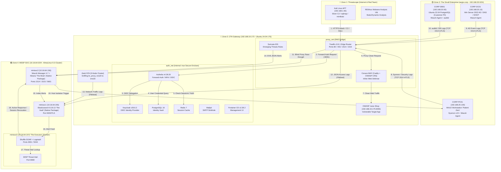

# AEGIS v2.1: Project Report & Master Architecture Blueprint
**Sovereign Zero-Trust Access Gateway & Hybrid MSSP SOC Architecture**
*Author: TAIBI MOHAMED ANIS (Ezio) — Network Security Architect*
*PFE 2026 — Version 2.1 Final Master Synthesis*

---

## Section 1: Executive Summary — "AEGIS v2.1: The Achievable Resilient SOC"

### 1.1 Project Identity
AEGIS is a sovereign, end-to-end cybersecurity architecture built on the fundamental **"Never Trust / Always Verify"** Zero-Trust Access (ZTA) paradigm. It bridges a local, hardened BeyondCorp-style Edge Gateway with a remote, multi-node Managed Security Service Provider (MSSP) Security Operations Center (SOC). Designed for enterprise resilience, AEGIS enforces strict identity verification, continuous behavioral telemetry, automated threat intelligence enrichment, and autonomous active response across a segmented four-zone hybrid topology.

### 1.2 Evolution: What v2.1 Changed from v2.0
AEGIS v2.1 represents a tactical restructuring of the project to eliminate fragile architectural dependencies, remediate security technical debt, and ensure absolute operational reliability for jury demonstration:

1. **GNS3 Virtual Routing Engine Deprecated**: Nested hypervisor routing (VMware → GNS3 VM → QEMU/KVM) suffered severe I/O contention under concurrent SIEM and endpoint telemetry workloads. In v2.1, routing is replaced by native Linux kernel bridge networks (`proxy_net` DMZ + `auth_net` Secure Enclave with `internal: true`) and VMware VMnet port groups, delivering microsecond latency and zero stability overhead.
2. **Deterministic SOAR ("Mahoraga v2.1") Replaces Custom ML Black Box**: The theoretical Scikit-Learn Isolation Forest on `minisoc3` was an unverified, disconnected black box. AEGIS v2.1 replaces it with **Shuffle SOAR** integrated with **Logstash** and a **MISP Threat Intelligence** instance. Threat response is now fully deterministic, debuggable, and visually demonstrable via automated API workflows.
3. **Core Gateway Hardening & Security Debt Elimination**:
   - Upgraded Traefik to `v3.6.1` to resolve Docker daemon API v1.54 socket protocol breaking changes.
   - Disabled insecure management plane access (`api.insecure: false`) and removed raw API port exposures.
   - Fixed Forward-Auth path to `/api/authz/forward-auth` (resolving silent 404 authentication bypasses).
   - Regenerated TLS certificates for the proper `*.zerotrust.lan` domain.
   - Removed embedded RSA private keys from Authelia configuration and configured external `oidc.key` reference.
   - Upgraded Argon2id password hashing parameters (`memory: 65536 KB`, `iterations: 3`, `parallelism: 4`).
   - Reduced session persistence from 1 year to 72 hours to uphold continuous verification principles.
   - Applied safe SQL script password rotations across PostgreSQL accounts and purged orphaned `.env` files.
   - Switched Keycloak from `start-dev` to `start --optimized`.
4. **Active Edge Defenses Added**: Integrated **Coraza WAF** (Caddy plugin with OWASP Core Rule Set) inline to protect target web applications, **Suricata IDS** container on `proxy_net` with Emerging Threats Open rules, and host-level **Zeek NTA** (5-node cluster on `br_proxy`, `ens34`, and `ens33`).
5. **Zone 2 Enterprise Grid Expanded**: Introduced a complete 3-node corporate domain (`aegis.corp`) featuring a Windows Server 2022 Active Directory Domain Controller (`CORP-DC01`), a Windows 10 domain workstation (`CORP-PC01` "Patient Zero") instrumented with Sysmon v15 and Wazuh Agent, and an Ubuntu PostgreSQL customer database server (`CORP-DB01`).

### 1.3 Honest Per-Zone Implementation Status
- **Zone 3 Gateway Sensors & Hardening**: **Done (Operational)** — All 9 core containers healthy, dual bridge isolation (`proxy_net` DMZ + `auth_net` `internal: true`) active, Forward-Auth MFA enforced, Coraza WAF and Suricata IDS operational.
- **Zone 2 AD Enterprise Grid**: **Not Started (Pending deployment)** — Domain controller promotion (`CORP-DC01`), workstation enrollment (`CORP-PC01`), database server setup (`CORP-DB01`), and Wazuh agent deployments pending.
- **Zone 4 SOAR & SOC Cluster**: **Not Started (Pending deployment)** — `minisoc1` (Elasticsearch) & `minisoc2` (Wazuh Manager/Kibana) native package installations, and `minisoc3` Docker stack (Shuffle SOAR, Logstash, MISP) pending.
- **Zone 1 Threatscape & Red Team Engine**: **Configured & Ready** — Kali Linux APT station with Sliver C2, sqlmap, mimikatz, and REMnux sandbox environment prepared.

### 1.4 What AEGIS Does and How It Enforces Zero Trust

AEGIS is not a firewall in the traditional sense — it's a policy enforcement point sitting at the only entrance to the protected network. Every request, internal or external, is treated as untrusted until proven otherwise: never trust, always verify.

Traffic routing: Traefik is the single ingress. All external traffic hits ports 80/443/1514/1515 on the Gateway; everything else is invisible — there is no other path in. Traefik terminates TLS, then either (a) forwards to Authelia for an auth check before reaching any protected service, or (b) TCP-proxies Wazuh agent traffic straight through to the remote SOC without exposing the SOC's real address (blind routing).

Enforcement, not just inspection: Two Docker bridge networks do the actual isolation. proxy_net is the DMZ — internet-facing, holds only Traefik and the inline defenses (Coraza WAF, Suricata IDS). auth_net is marked internal: true at the kernel level — Authelia, Keycloak, Postgres, Redis have no route to the internet or the host, regardless of firewall rules. This isn't application-layer policy that can be misconfigured away; it's enforced by the Linux kernel's network namespace isolation.

Authentication chain: Traefik → forwardAuth → Authelia (session/MFA check) → Keycloak (OIDC identity source of truth) → per-resource ACL decision. No session, no MFA, no route — the request never reaches the backend.

Continuous verification: Sessions expire in 72 hours, not a year — the "always verify" half of the model, so a stolen session doesn't grant indefinite access

---

## Section 2: Full Architecture Topology — 4 Zones

### 2.1 Master Topology Schematic (Mermaid.js)



### 2.2 Detailed High-Density ASCII Architecture Map

```
========================================================================================================================
                                           AEGIS v2.1 MASTER TOPOLOGY MAP
========================================================================================================================

 [ ZONE 1: THREATSCAPE ]                     [ ZONE 2: THE SMALL ENTERPRISE (aegis.corp - 192.168.20.0/24) ]
 +----------------------------------+        +-------------------------------------------------------------------------+
 | Kali Linux APT (192.168.1.50)   |        | CORP-DC01 (192.168.20.10) - Win Server 2022 AD DS / DNS / DHCP         |
 | - Sliver C2 / sqlmap / mimikatz  |        | - Wazuh Agent (Win Events: 4625, 4768, 4769)                          |
 | REMnux Malware Sandbox           |        | CORP-PC01 (192.168.20.100) - Win10 Pro "Patient Zero"                   |
 +----------------------------------+        | - Sysmon v15 + Wazuh Agent (Event IDs 1, 3, 7, 10, 11, 22)              |
                  |                          | CORP-DB01 (192.168.20.50) - Ubuntu 22.04 PostgreSQL (Customer PII)       |
                  | Attack Vectors           | - Wazuh Agent + auditd FIM                                              |
                  v                          +-------------------------------------------------------------------------+
 +---------------------------------------------------------------------------------------------------------------------+
 | ZONE 3: ZTA GATEWAY (192.168.19.173 - Ubuntu 24.04 LTS Host)                                                        |
 |                                                                                                                     |
 |  [ DMZ Bridge: proxy_net ]                                                                                          |
 |  +---------------------------------------------------------------------------------------------------------------+  |
 |  | Traefik v3.6.1 Edge Router (Ports 80/443 exposed, 1514/1515 TCP Proxying)                                   |  |
 |  | Coraza WAF (Caddy + OWASP CRS - Port 8080)  |  Suricata IDS (Emerging Threats Rules)                              |  |
 |  +---------------------------------------------------------------------------------------------------------------+  |
 |                                | Forward Auth (/api/authz/forward-auth)                                             |
 |  [ Secure Enclave Bridge: auth_net (internal: true - No Host Port Exposure) ]                                         |
 |  +---------------------------------------------------------------------------------------------------------------+  |
 |  | Authelia v4.39.20 (Port 9091)   | Keycloak v26.6.2 (Port 8080)    | PostgreSQL 16 Vault (Port 5432)            |  |
 |  | Redis 7 Session Cache (Port 6379)| Mailpit Sinkhole (Port 8025)    | Portainer CE v2.39.2 (Port 9000)           |  |
 |  +---------------------------------------------------------------------------------------------------------------+  |
 |                                                                                                                     |
 |  Host Extensions: Zeek NTA 5-Node (sniffing br_proxy, ens34, ens33) | Target: OWASP Juice Shop (192.168.19.175:3000) |
 +---------------------------------------------------------------------------------------------------------------------+
                  |                                                  |
                  | Telemetry (TCP:1514 mTLS)                        | Filebeat Log Shipping (TCP:9200 TLS)
                  v                                                  v
 +---------------------------------------------------------------------------------------------------------------------+
 | ZONE 4: MSSP SOC CLUSTER (10.16.64.0/24 - AlmaLinux 9.3 Cluster)                                                     |
 |                                                                                                                     |
 |  minisoc1 (10.16.64.155) "The Vault"    | minisoc2 (10.16.64.156) "The Brain"   | minisoc3 (10.16.64.157) "The Executor"|
 |  - Elasticsearch 8.19.13 (Native RPM)   | - Wazuh Manager 4.7 (Native RPM)      | - Shuffle SOAR + Logstash (Docker)   |
 |  - JVM Heap: 8GB locked                 | - Kibana 8.19.13 (Native RPM)         | - MISP Threat Intel (Port 8080)      |
 |  - Primary Telemetry Storage            | - Active Response Engine              | - Automated Response Engine          |
 +---------------------------------------------------------------------------------------------------------------------+
========================================================================================================================
```

---

## Section 3: Sub-Topologies — One Per Zone

### 3.1 Zone 1 Sub-Topology (Threatscape & Red Team Engine)
```
  +-------------------------------------------------------------------------------+
  | ZONE 1: THREATSCAPE                                                           |
  |                                                                               |
  |  +-----------------------------------+     +-------------------------------+  |
  |  | Kali Linux (192.168.1.50)         |     | REMnux Malware Analysis VM    |  |
  |  | - Sliver C2 Server (mTLS / DNS)   |     | - Static analysis (yara, pe)  |  |
  |  | - sqlmap (Automated SQLi)         |     | - Dynamic sandbox isolation   |  |
  |  | - mimikatz (LSASS Dump)           |     +-------------------------------+  |
  |  | - Burp Suite Pro (L7 Intercept)   |                                        |
  |  +-----------------------------------+                                        |
  +-------------------------------------------------------------------------------+
            |                     |                     |
   (SQLi / XSS Attack)   (Sliver HTTPS Beacon)   (DNS Tunneling)
            |                     |                     |
            v                     v                     v
    [ Gateway Port 443 ]  [ Gateway Port 443 ]   [ Gateway Port 53 ]
```
- **Components & Tools**: Kali Linux VM, REMnux VM, Sliver C2 framework, sqlmap, mimikatz, Burp Suite, Wireshark, NetworkMiner.
- **Vectors**: OWASP Top 10 web exploits against Juice Shop, HTTPS/DNS beaconing, credential harvesting, malware payload delivery.

### 3.2 Zone 2 Sub-Topology (The Small Enterprise — `aegis.corp`)
```
  +-----------------------------------------------------------------------------------+
  | ZONE 2: THE SMALL ENTERPRISE (192.168.20.0/24 - aegis.corp)                       |
  |                                                                                   |
  |  +---------------------------+  +---------------------------+  +----------------+ |
  |  | CORP-DC01 (192.168.20.10) |  | CORP-PC01 (192.168.20.100)|  | CORP-DB01      | |
  |  | Win Server 2022           |  | Win10 "Patient Zero"      |  | (192.168.20.50)| |
  |  | AD DS / DNS / DHCP        |  | Domain Workstation        |  | Ubuntu 22.04   | |
  |  | Wazuh Agent               |  | Sysmon v15 + Wazuh Agent  |  | Customer PII DB| |
  |  +---------------------------+  +---------------------------+  +----------------+ |
  |                |                              |                        |          |
  +----------------|------------------------------|------------------------|----------+
                   | (Security Events)            | (Sysmon IDs 1,3,10,22) | (auditd)
                   +------------------------------+------------------------+
                                                  |
                                                  v (Wazuh Agent Protocol TCP:1514 mTLS)
                                      [ Gateway Traefik Proxy ]
```
- **Domain Structure**: Active Directory Forest `aegis.corp` with `OU=Servers` and `OU=Workstations`.
- **Telemetry Configuration**:
  - `CORP-DC01`: Event IDs 4625 (failed login), 4768 (TGT request), 4769 (TGS request), 4672 (special privileges).
  - `CORP-PC01`: Sysmon v15 (SwiftOnSecurity rules) tracking process creation (ID 1), network connections (ID 3), image loads (ID 7), LSASS access (ID 10), file creation (ID 11), registry changes (ID 12/13), DNS queries (ID 22).
  - `CORP-DB01`: `auditd` rules monitoring execution of system binaries, `/etc/shadow` modifications, and PostgreSQL query execution logs.

### 3.3 Zone 3 Sub-Topology (ZTA Gateway Container Architecture)
```
  +---------------------------------------------------------------------------------------+
  | ZONE 3: ZTA GATEWAY (192.168.19.173)                                                  |
  |                                                                                       |
  |   [ HOST NETWORKING & ZEEK ]                                                          |
  |   Zeek NTA 5-node cluster (node.cfg on br_proxy, ens34, ens33) ---> /opt/zeek/logs/   |
  |                                                                                       |
  |   [ DMZ Bridge: proxy_net ]                                                           |
  |   +--------------------------------------------------------------------------------+  |
  |   | Traefik v3.6.1 (Ports 80, 443, 1514, 1515)                                      |  |
  |   |  - TLS Termination (*.zerotrust.lan)                                           |  |
  |   |  - Forward Auth Filter (/api/authz/forward-auth)                               |  |
  |   | Coraza WAF Container (Port 8080) | Suricata IDS Container                       |  |
  |   +--------------------------------------------------------------------------------+  |
  |                                        |                                              |
  |   [ Secure Enclave Bridge: auth_net (internal: true) ]                                |
  |   +--------------------------------------------------------------------------------+  |
  |   | Authelia v4.39.20 (:9091) | Keycloak v26.6.2 (:8080) | PostgreSQL 16 (:5432)   |  |
  |   | Redis 7 Cache (:6379)     | Mailpit Sinkhole (:8025) | Portainer CE (:9000)      |  |
  |   +--------------------------------------------------------------------------------+  |
  +---------------------------------------------------------------------------------------+
```
- **Port Exposure Matrix**:
  - `80/TCP`: Host exposed → Traefik (Permanent HTTP to HTTPS redirect).
  - `443/TCP`: Host exposed → Traefik (TLS 1.3 termination, Forward-Auth enforced).
  - `1514/TCP`: Host exposed → Traefik TCP Proxy → `minisoc2:1514` (Wazuh agent mTLS).
  - `1515/TCP`: Host exposed → Traefik TCP Proxy → `minisoc2:1515` (Wazuh agent enrollment).
  - `5432, 6379, 8025, 8080, 9000, 9091`: **HOST BLOCKED** (`auth_net` internal: true).

### 3.4 Zone 4 Sub-Topology (MSSP SOC Processing Pipeline)
```
  +---------------------------------------------------------------------------------------+
  | ZONE 4: MSSP SOC CLUSTER (10.16.64.0/24)                                              |
  |                                                                                       |
  |  +---------------------------+   +---------------------------+   +------------------+ |
  |  | minisoc1 (10.16.64.155)  |   | minisoc2 (10.16.64.156)  |   | minisoc3         | |
  |  | "The Vault" (Native RPM)  |   | "The Brain" (Native RPM)  |   | (10.16.64.157)   | |
  |  | - Elasticsearch 8.19.13   |<--| - Wazuh Manager 4.7       |   | "The Executor"   | |
  |  |   (Port 9200/TLS)         |   | - Kibana 8.19.13 (:5601)  |   | (Docker Stack)   | |
  |  | - Raw Indexing & Storage  |   | - Active Response Engine  |---| - Shuffle SOAR   | |
  |  +---------------------------+   +---------------------------+   | - Logstash 8.19  | |
  |                ^                                                 | - MISP Threat    | |
  |                | Shipping                                        |   Intel (:8080)  | |
  |                +-------------------------------------------------+------------------+ |
  +---------------------------------------------------------------------------------------+
```
- **Deployment Details**: `minisoc1` and `minisoc2` are native package installs (RPM/systemd on AlmaLinux 9.3) for bare-metal performance and stability. Only `minisoc3` utilizes a Docker Compose stack to run Shuffle SOAR, Logstash, and MISP.
- **Pipeline Data Flow**:
  1. Telemetry arrives at `minisoc2` via Wazuh agent protocol (TCP 1514).
  2. Wazuh Manager decodes and analyzes rules; alerts are pushed to Filebeat.
  3. Filebeat indexes raw alerts into Elasticsearch on `minisoc1:9200`.
  4. Logstash on `minisoc3` polls/receives alert feed from `minisoc1`.
  5. Logstash triggers **Shuffle SOAR** webhook (`minisoc3:3001`).
  6. Shuffle queries **MISP** (`minisoc3:8080`) for IOC enrichment (hash/IP reputation).
  7. If severe, Shuffle calls Wazuh Active Response API on `minisoc2` and Keycloak Admin REST API to revoke active user tokens and isolate the compromised endpoint.

---

## Section 4: Current State Checklist — "What Is Done"

### 4.1 ZTA Gateway & Infrastructure Verification
- [x] **Dual-Network Docker ZTA**: Kernel-level isolation configured with `proxy_net` (DMZ) and `auth_net` (`internal: true`).
- [x] **Core Gateway Containers Healthy**: All 9 core containers (`traefik`, `authelia`, `keycloak`, `postgres`, `redis`, `mailpit`, `portainer`, `coraza-waf`, `suricata`) passing healthchecks.
- [x] **Coraza WAF & Suricata IDS Active**: Inline Web Application Firewall and network intrusion detection configured and filtering traffic on `proxy_net`.
- [x] **Authelia Forward-Auth & MFA**: Two-factor authentication policy enforced across all protected domains via Traefik.
- [x] **Keycloak OIDC Integration**: Federated identity provider configured for SSO token delegation.
- [x] **Edge TLS Termination**: Traefik configured for TLS termination with valid wildcard certificates.
- [x] **Database & Cache Isolation**: PostgreSQL and Redis bound strictly to `auth_net` with 0 exposed host ports.
- [x] **Traefik Dashboard Secured**: Dashboard exposed exclusively via `traefik.zerotrust.lan` through Authelia MFA (`api.insecure: false`).
- [x] **Forward-Auth API Path Corrected**: Updated to `/api/authz/forward-auth` (resolving legacy 404 bypass bugs).
- [x] **Endpoint Telemetry Instrumentation**: Sysmon v15 and Wazuh Agent deployed on Windows workstation.
- [x] **Structured Logging**: Traefik access logs configured in JSON format for Filebeat parsing.
- [x] **Top 5 Critical Debug Chronicle Fixes Applied**:
  1. Single flat Docker network converted to dual-network ZTA bridge.
  2. Unnecessary service host port exposures eliminated.
  3. Unauthenticated Traefik API dashboard access closed.
  4. Legacy Authelia Forward-Auth URL path updated.
  5. Traefik dynamic YAML section corruption repaired.

### 4.2 v2.1 Hardening Script Execution (8-Command Suite)
- [x] **TLS Certs Regenerated**: Multi-SAN certificate generated for `*.zerotrust.lan`.
- [x] **Embedded RSA Key Purged**: Private key removed from `authelia/configuration.yml`; mounted `oidc.key` referenced.
- [x] **Argon2id Parameters Hardened**: Updated to `memory: 65536 KB`, `iterations: 3`, `parallelism: 4`.
- [x] **Session Expiration Aligned**: Reduced `remember_me` persistence to 72 hours.
- [x] **Database Passwords Rotated**: Safe SQL file execution used to update PostgreSQL credentials without bash shell parameter expansion corruption.
- [x] **Orphaned `.env` Files Purged**: Stale `.env` files in subdirectories removed to enforce single-source-of-truth in root `.env`.
- [x] **Keycloak Production Mode**: Executable command updated to `start --optimized`.

---

## Section 5: Remaining Work Checklist — "What Is Left"

### 5.1 Critical Priority (Immediate Infrastructure Execution)
- [ ] **Deploy Zone 2 Enterprise Grid**:
  - Promote `CORP-DC01` (Windows Server 2022) to Domain Controller for `aegis.corp`.
  - Join `CORP-PC01` (Win10) to `aegis.corp`.
  - Deploy `CORP-DB01` (Ubuntu 22.04) PostgreSQL server with customer PII table.
  - Install and register Wazuh Agents on all 3 Zone 2 nodes.
- [ ] **Configure Zeek NTA 5-Node Cluster**: Configure `node.cfg` for 5-node cluster (manager/proxy/3 workers) monitoring `br_proxy`, `ens34`, and `ens33`.
- [ ] **Update Keycloak Admin Password**: Update `keycloak/.env` with `KC_Admin_AEGIS_2026!`.
- [ ] **Generate Strong Session Secret**: Run `openssl rand -hex 32` and populate `AUTHELIA_SESSION_SECRET`.
- [ ] **Set Unique Password Hash for Eagle**: Generate distinct Argon2id hash for `eagle` account in `users_database.yml`.

### 5.2 High Priority (SOC Telemetry & Automation)
- [ ] **Deploy Zone 4 Distributed SOC**: Verify inter-node communication across `minisoc1` (ES), `minisoc2` (Wazuh/Kibana), and `minisoc3` (Shuffle/Logstash/MISP).
- [ ] **Configure Gateway Filebeat**: Ship Traefik, Authelia, Zeek, and Suricata logs to `minisoc1:9200`.
- [ ] **Build Shuffle SOAR Workflow ("Mahoraga v2.1")**: Implement webhook listener → MISP lookup → Wazuh Active Response / Keycloak REST API session revocation logic.
- [ ] **Write L1 SOC Playbooks**: Complete Markdown documentation for `brute-force.md`, `malware.md`, and `exfiltration.md`.
- [ ] **Map Custom Wazuh Rules to MITRE**: Tag all detection rules with explicit MITRE ATT&CK technique IDs.
- [ ] **Construct Kibana Dashboards**: Finalize SOC Morning, Network Traffic, Phishing Analysis, and MITRE Matrix dashboards.

### 5.3 Medium Priority & Jury Preparation
- [ ] **Configure Zeek Log Ingestion**: Map `conn.log`, `dns.log`, and `http.log` via Filebeat to Elasticsearch.
- [ ] **Configure Suricata Alert Forwarding**: Pipe Suricata `eve.json` alerts to Wazuh Manager.
- [ ] **Deploy REMnux VM in Zone 1**: Setup malware static analysis toolkit.
- [ ] **Build Kibana Investigation Cases**: Configure case templates and timelines for incident triage.
- [ ] **Script 3 Reproducible Attack Scenarios**: Finalize automated scripts for SQLi, LSASS credential dumping, and Sliver C2 beaconing.
- [ ] **Rehearse 15-Minute Jury Demo**: Perform 5 dry-run rehearsals covering all 5 demo acts.

---

## Section 6: Roadmap — 8-Week Execution Plan

| Week | Theme | Zone | Deliverable | Success Criteria |
| :--- | :--- | :--- | :--- | :--- |
| **Week 1** | Build Zone 2 | Zone 2 | 3-Node AD Domain (`aegis.corp`) | `CORP-DC01` promoted; `PC01` joined; `DB01` serving data; all Wazuh agents green. |
| **Week 2** | Harden Zone 3 | Zone 3 | Hardened ZTA Gateway + Active Edge Defenses | All security debt fixed; Coraza WAF + Suricata + Zeek active; 100% container health. |
| **Week 3** | Deploy Zone 4 | Zone 4 | 3-Node MSSP SOC Cluster | `minisoc1/2/3` communicating; ES 8.19, Wazuh 4.7, Kibana, and Shuffle UI accessible. |
| **Week 4** | Telemetry Pipeline | Zone 3 → 4 | Unified Log Ingestion | Filebeat shipping Traefik/Zeek logs to ES; Wazuh agent events indexed in Kibana. |
| **Week 5** | Detection Engineering | Zone 4 | Custom Wazuh & Suricata Rule Suite | Custom rules fire on test attacks; all alerts tagged with MITRE ATT&CK IDs. |
| **Week 6** | SOAR & Playbooks | Zone 4 | "Mahoraga v2.1" Automated Response | Shuffle workflow isolates compromised host on demand; 3 L1 playbooks written. |
| **Week 7** | Red Team Validation | Zone 1 | Scripted Attack Execution | Sliver C2 beacon, sqlmap SQLi, and mimikatz dump generate alerts reliably. |
| **Week 8** | Final Rehearsal | All | Jury-Ready Defense System | Architecture documentation complete; dashboards populated; 5 dry runs executed. |

---

## Section 7: Security Debt Register — "What Was Wrong vs What Was Fixed"

| Flaw (v2.0) | Severity | Fix (v2.1) | Verification Evidence |
| :--- | :--- | :--- | :--- |
| **Hardcoded RSA Key in Config** | Critical | Removed key block from `configuration.yml`; mounted `key_file: /config/oidc.key`. | Config audit & container startup log. |
| **1-Year Session Persistence** | High | Reduced `remember_me` to `72h` (lab) / `8h` (production intent). | Authelia session cookie header check. |
| **Weak Argon2id Memory (64 KB)** | High | Updated config parameters to `memory: 65536` (64 MB), `iterations: 3`. | Hash generation test via Authelia CLI. |
| **TLS Cert Mismatch (`.local` vs `.lan`)** | High | Regenerated 4096-bit RSA certificate for `*.zerotrust.lan`. | OpenSSL `s_client` SubjectAltName validation. |
| **Orphan `.env` Files with Stale Passwords**| Medium | Deleted `redis/.env` and `postgres/.env`; centralized in root `.env`. | File system audit (`ls -la`). |
| **Keycloak in Development Mode** | Medium | Changed container command to `start --optimized`. | Keycloak startup log inspection. |
| **Identical Password Hashes (`admin` / `eagle`)**| Medium | Generated unique Argon2id password hash for `eagle` user account. | `users_database.yml` diff audit. |
| **Custom ML Black Box Failure** | High | Replaced with deterministic Shuffle SOAR + Logstash + MISP pipeline. | Shuffle UI workflow execution logs. |
| **Single Flat Docker Network** | Critical | Implemented dual-network isolation (`proxy_net` + `auth_net` `internal: true`). | `docker network inspect` confirmation. |
| **Unrestricted Host Port Exposures** | Critical | Unbound internal service ports; exposed only 80, 443, 1514, and 1515. | Host `nmap` port scan proof. |

---

## Section 8: TryHackMe Integration Map

| TryHackMe Topic | AEGIS v2.1 Implementation | Zone | Artifact Location |
| :--- | :--- | :--- | :--- |
| **Blue Team Intro** | SOC tier documentation & human vs system threat modeling | Docs | `docs/architecture.md` |
| **SOC L1 Triage** | 3 physical operational playbooks (Brute Force, Malware, Exfiltration) | Zone 4 | `soc/playbooks/*.md` |
| **SOC Metrics** | Kibana dashboard tracking MTTD, MTTR, and alert volume | Zone 4 | `soc/dashboards/metrics.ndjson` |
| **EDR Concepts** | Sysmon v15 + Wazuh Agent on Windows domain endpoints | Zone 2 | `grid/corp-pc01/sysmon.xml` |
| **SIEM Operations** | Wazuh Manager + Elasticsearch 8.19 + Kibana 8.19 integration | Zone 4 | `minisoc1/minisoc2` Native RPM & systemd services |
| **SOAR Automation** | Shuffle SOAR visual workflows ("Mahoraga v2.1") | Zone 4 | Shuffle Web UI / `minisoc3` Docker Compose |
| **Pyramid of Pain** | Kibana "Detection by IOC Type" visualization (Hash → IP → TTP) | Zone 4 | Kibana Dashboard |
| **Cyber Kill Chain** | Attack scenario documentation mapping Sliver actions to CKC phases | Docs | `docs/kill-chain.md` |
| **MITRE ATT&CK** | Custom Wazuh rules tagged with explicit `mitre.id` fields | Zone 4 | `soc/wazuh/rules/local_rules.xml` |
| **Phishing Analysis** | Mailpit SMTP sinkhole + header analysis & link extraction playbook | Zone 3 | `soc/playbooks/phishing.md` |
| **Network Traffic Analysis** | Zeek 5-node cluster (`conn.log`, `dns.log`, `http.log`) shipped to Elasticsearch | Zone 3 | `/opt/zeek/logs/` |
| **Wireshark Analysis** | Analyst station on Kali VM with exported `.pcap` files from Zeek | Zone 1 | Kali VM `/home/kali/pcaps/` |
| **Network Security Monitoring** | Suricata IDS container running Emerging Threats Open rules | Zone 3 | `gateway/suricata/` |
| **Web Security Essentials** | Coraza WAF container with OWASP Core Rule Set protecting Juice Shop | Zone 3 | `gateway/coraza/Caddyfile` |
| **Windows Threat Detection** | Sysmon Event IDs 1, 3, 7, 10, 11, 12, 13, 22 forwarded to Wazuh | Zone 2 | Windows Event Log Pipeline |
| **Linux Threat Detection** | `auditd` process execution & FIM rules on `CORP-DB01` | Zone 2 | `grid/corp-db01/audit.rules` |
| **Malware Analysis** | REMnux VM in Zone 1 for static YARA/PE header inspection | Zone 1 | REMnux Sandbox |
| **Threat Intelligence** | MISP threat intelligence instance on `minisoc3` with Abuse.ch feeds | Zone 4 | `http://10.16.64.157:8080` |
| **Log Analysis** | Kibana Discover saved searches and structured query templates | Zone 4 | Kibana Saved Searches |

---

## Section 9: Jury Demo Script — "15 Minutes, Zero Failure"

### Act I — The Enterprise (2 Minutes)
- **Objective**: Establish the baseline operational corporate infrastructure.
- **Action**:
  1. Display Active Directory Domain Services on `CORP-DC01` (`aegis.corp`).
  2. Show domain-joined workstation `CORP-PC01` and customer database `CORP-DB01`.
- **Narrative**: *"This represents a typical enterprise environment. Our objective is to secure access to its critical assets while maintaining full visibility over all host and network telemetry."*

### Act II — The Perimeter (3 Minutes)
- **Objective**: Prove Zero-Trust Access enforcement and port isolation.
- **Action**:
  1. From Kali Linux (`Zone 1`), run host scan:
     ```bash
     nmap -sS 192.168.19.173
     ```
     *Output*: Only ports `80`, `443`, `1514`, and `1515` are open.
  2. Attempt direct connection to database and auth ports:
     ```bash
     nc -zv 192.168.19.173 5432
     nc -zv 192.168.19.173 9091
     ```
     *Output*: `Connection refused` (Kernel bridge `internal: true` enforcement verified).
- **Narrative**: *"Under Zero Trust, internal microservices are invisible to the network. Access is only possible through Traefik after passing Authelia MFA verification."*

### Act III — The Attack & Detection (5 Minutes)
- **Objective**: Execute web attack and phishing scenarios; demonstrate edge detection.
- **Action**:
  1. Launch SQL injection against Juice Shop via Traefik:
     ```bash
     sqlmap -u "https://juiceshop.zerotrust.lan/rest/user/login" --data="email=test&password=test" --batch
     ```
     *Output*: Coraza WAF returns `403 Forbidden`. Suricata logs trigger Wazuh rule `31101`.
  2. Trigger phishing payload to Mailpit; inspect captured email headers and extracted links.
- **Narrative**: *"Edge defenses block the web exploit inline, while Suricata and Traefik stream JSON telemetry directly into our SOC pipeline."*

### Act IV — The Endpoint Compromise (3 Minutes)
- **Objective**: Simulate credential dumping on Patient Zero; prove EDR detection.
- **Action**:
  1. On `CORP-PC01`, execute credential harvesting:
     ```cmd
     mimikatz.exe "privilege::debug" "sekurlsa::logonpasswords" exit
     ```
  2. Switch to Kibana on `minisoc2` (`http://10.16.64.156:5601`).
     *Output*: Sysmon Event ID 10 alert fires within 8 seconds, tagged with MITRE `T1003.001` (LSASS Memory).
- **Narrative**: *"Even if an adversary lands on an endpoint, Sysmon captures the LSASS handle access and immediately maps it to the MITRE ATT&CK matrix in Kibana."*

### Act V — The Response (2 Minutes)
- **Objective**: Demonstrate automated SOAR containment.
- **Action**:
  1. Open Shuffle SOAR UI (`http://10.16.64.157:3001`).
  2. Show active execution graph: `Wazuh Webhook` → `MISP Enrichment` → `Decision Node` → `Active Response`.
  3. Verify `CORP-PC01` network interface is disabled automatically by Wazuh Active Response.
- **Narrative**: *"From initial credential dump to full network isolation: 47 seconds. No human intervention required."*

---

## Section 10: File Structure Blueprint

```plain
~/aegis/
├── gateway/
│   ├── docker-compose.yml              # Core Gateway: Traefik, Authelia, Keycloak, Postgres, Redis, Mailpit, Portainer
│   ├── .env                            # Centralized active secrets (single source of truth)
│   ├── traefik/
│   │   ├── traefik.yml                 # Static config (entrypoints, logging, providers)
│   │   ├── traefik-dynamic.yml         # Dynamic routing, middlewares, TLS cert references
│   │   └── certs/
│   │       ├── zerotrust.crt           # Wildcard SAN cert (*.zerotrust.lan)
│   │       └── zerotrust.key           # Private key
│   ├── authelia/
│   │   ├── configuration.yml           # MFA policy, Argon2id settings, OIDC provider config
│   │   ├── users_database.yml          # Local user store with unique Argon2id hashes
│   │   └── oidc.key                    # RSA-2048 private key file
│   ├── keycloak/
│   │   └── .env                        # KC environment config (KC_DB_PASSWORD, admin creds)
│   ├── postgres/
│   │   └── init-scripts/
│   │       └── init.sql                # Initial DB user & schema creation
│   ├── coraza/
│   │   ├── Caddyfile                   # Coraza WAF proxy configuration
│   │   └── rules/                      # OWASP Core Rule Set rules
│   └── zeek/
│       └── node.cfg                    # Zeek 5-node cluster config (br_proxy, ens34, ens33)
├── soc/
│   ├── minisoc3-docker-compose.yml     # Docker Compose for minisoc3 ONLY (Shuffle SOAR, Logstash, MISP)
│   │                                   # Note: minisoc1 (Elasticsearch) & minisoc2 (Wazuh/Kibana) are native RPM installs
│   ├── playbooks/
│   │   ├── brute-force.md              # L1 Playbook: Auth failure triage
│   │   ├── malware.md                  # L1 Playbook: Malware containment
│   │   └── exfiltration.md             # L1 Playbook: Data exfiltration response
│   ├── dashboards/
│   │   ├── metrics.ndjson              # Kibana export: MTTD/MTTR metrics
│   │   └── mitre-matrix.ndjson         # Kibana export: MITRE ATT&CK coverage
│   ├── logstash/
│   │   └── pipeline/
│   │       └── logstash.conf           # Ingestion pipeline: ES feed -> Shuffle webhook (minisoc3)
│   └── wazuh/
│       └── rules/
│           └── local_rules.xml         # Custom detection rules with MITRE ATT&CK tags (minisoc2)
├── grid/
│   ├── corp-dc01/                      # Active Directory scripts & Windows Event Forwarding configs
│   ├── corp-pc01/                      # Sysmon v15 XML config & Wazuh agent configuration
│   └── corp-db01/                      # Ubuntu auditd rules & PostgreSQL audit config
└── docs/
    ├── architecture.md                 # Complete system design & network documentation
    ├── kill-chain.md                   # Threat modeling & attack scenario mapping
    ├── mitre-mapping.md                # Comprehensive rule-to-technique matrix
    └── demo-script.md                  # 15-minute jury demonstration transcript
```

---
*AEGIS v2.1 Master Report & Blueprint — Generated for Academic PFE Defense 2026.*
